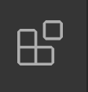

# Introduction_p5js

This is a french introduction to [p5*js](http://p5js.org)

P5js est un projet issu de [processing](https://processing.org/) qui est un langage de programmation basé sur java orienté vers la création graphique et interactive. P5js a pour but de transposer l'esprit de processing au web et donc au langage javascript. C'est un framework simple d'accès pour les débutants avec une bonne documentation et une communauté active. 

Si jamais vous ne connaissez ni processing, ni p5js, il peut-être intéressant de jeter un oeil à la vidéo d'introduction de [Hello Processing](https://hello.processing.org/) qui vous donnera un aperçu assez complet de ce qu'il est possibble de faire avec ce genre d'outils.

P5js propose l'intégration dans un canvas html5 d'un maximum de fonction pour le dessin et d'animation, des possibilités d'interaction à travers différentes interfaces homme machine (clavier, souris, webcam, micro ...), ou encore avec les composants d'une page web et un support partiel mais en développement de webgl.

De nombreuses bibliothèques viennent offrir de nouvelles possibilité, mais il p5js peut naturellement s'interfacer avec n'importe quelle bibliothèques js.

P5js est différent de processing.js par le fait que le langage de base est le js. Lorsqu'on utilise processing.js on a générallement développé un programme avec processing et on utilise processing.js pour traduire le programme en javascript qui devient alors exécutable dans une page web. Avec p5js on code directement en javascript un langage natif pour les navigateurs.

Cette introduction va couvrir l'essentiel du workflow avec p5js, présenter les différentes fonctions de dessin et la base de la programmation en js (conditions, boucles for, variables, fonctions, utilisation de tableaux et prototypage d'objets javascript et à la toute fin des exemples couvrant les bases de la 3D avec webgl et de l'audio avec la web audio api = waa).

<a name="contenu"/>

## Contenu

* [Comment travailler avec p5js](#p5js_tools)<br>
* [Principes de bases](#bases)<br>
* [Dessiner avec la souris](#dessiner)<br>
	*	[Les couleurs et la transparence](#couleurs)<br>
	*	[Utilisation de variables](#simuler) - [**DEMO**](https://b2renger.github.io/Introduction_p5js/01_dessiner_01/index.html)<br>
	*	[Réaliser des symétries](#symetries) - [**DEMO**](https://b2renger.github.io/Introduction_p5js/01_dessiner_02/index.html)<br>
	*	[Créer des fonctions javascript](#fonctions)<br>
	*	[Utiliser les transformations de l'espace : effet spirographe](#transformations) - [**DEMO**](https://b2renger.github.io/Introduction_p5js/01_dessiner_04/index.html)<br>
	*	[Conditions, boucles et coordonnées polaires : effet "spray-can"](#spray) - [**DEMO 1**](https://b2renger.github.io/Introduction_p5js/01_dessiner_05/index.html) - [**DEMO 2**](https://b2renger.github.io/Introduction_p5js/01_dessiner_06/index.html)<br>
		*	[Conditions : "if"](#conditions)<br>
		*	[Coordonnées polaires](#polaire)<br>
		*	[Boucles : "for"](#boucles)<br> 
* [DOM](#dom)<br>
	*	[Utilisation de la bibliothèque](#utilisation) - [**DEMO 1**](https://b2renger.github.io/Introduction_p5js/02_dom_01/index.html) - [**DEMO 2**](https://b2renger.github.io/Introduction_p5js/02_dom_02/index.html)<br>
		*	[Créer des éléments HTML5](#html5)<br>
		*	[Styliser avec du css](#css)<br>
	*	[Utilisation de la vidéo](#video) - [**DEMO**](https://b2renger.github.io/Introduction_p5js/02_dom_03/index.html)<br>
	*	[Manipulation dun flux vidéo](#video-filtres) - [**DEMO**](https://b2renger.github.io/Introduction_p5js/02_dom_04/index.html)<br>
	*	[Mode instance de p5js](#instanciation) - [**DEMO**](https://b2renger.github.io/Introduction_p5js/02_dom_05/index.html)<br>
	*	[Exemple de site web](#siteweb)<br>
* [SocketIO](#socket) - [**DEMO1**](https://www.openprocessing.org/sketch/390650) - [**DEMO2**](https://www.openprocessing.org/sketch/390497)<br>
	* [Utilisation des bibliothèques](#socket-libs)<br>
	* [JSON = JavaScript Object Notation](#socket-json)<br>
	* [Emettre et recevoir des données dans une page web](#socket-emit)<br>
	* [NodeJs et serveur local](#socket-localhost)<br>
* [L'utilisation de bibliothèques : quicksettingsjs - gui](#quicksettings)  - [**DEMO**](https://b2renger.github.io/Introduction_p5js/99_quicksettings/index.html)<br>
* [Animation](#animation)<br>
  * [Balle rebondissant contre les parois](#balle) - [**DEMO**](https://b2renger.github.io/Introduction_p5js/04_animation_01/index.html)<br>
  * [Suivre la souris](#souris) - [**DEMO**](https://b2renger.github.io/Introduction_p5js/04_animation_02/index.html) - [**DEMO2**](https://b2renger.github.io/Introduction_p5js/04_animation_02_penner_position/index.html)<br>
  * [Suivre la souris avec des forces](#sourisforces) - [**DEMO**](https://b2renger.github.io/Introduction_p5js/04_animation_03/index.html)<br>
  * [Croissance de tentacules](#tentacules) - [**DEMO**](https://b2renger.github.io/Introduction_p5js/04_animation_04/index.html)<br>
* [Objets](#objets)<br>
    * [Objets et Instances](#oop) - [**DEMO**](https://b2renger.github.io/Introduction_p5js/05_objets_01/index.html)<br>
    * [Tableaux](#tableaux) - [**DEMO**](https://b2renger.github.io/Introduction_p5js/05_objets_02/index.html)<br>
    * [Pour aller un peu plus loin](#tableaux) - [**DEMO**](https://b2renger.github.io/Introduction_p5js/05_objets_03/index.html)<br>
* [Webgl et 3D](#webgl)<br>
    * [Caméra, lumière, la bibliothèque Quicksettings.js](#3d) - [**DEMO**](https://b2renger.github.io/Introduction_p5js/06_webgl_01/index.html)<br>
    * [Algorithme de "dla", appliquer des textures](#dla) - [**DEMO**](https://b2renger.github.io/Introduction_p5js/06_webgl_02/index.html)<br>
    * [Tentacules revisitées en 3D](#tentacules3D) - [**DEMO**](https://b2renger.github.io/Introduction_p5js/06_webgl_03/index.html)<br>
    * [Génération d'arbres](#tree) - [**DEMO**](https://b2renger.github.io/Introduction_p5js/06_webgl_04/index.html)<br>
    * [Algorithme de "flocking"](#flock) - [**DEMO**](https://b2renger.github.io/Introduction_p5js/06_webgl_05/index.html)<br> 
* [Audio et p5.sound](#son)<br>
    * [Utiliser des soundfonts, pour une palette sonore variée](#soundfont) -- [**DEMO**](https://b2renger.github.io/Introduction_p5js/07_audio_01_soundfont/index.html)<br>
    * [Jouer des fichier audio, utiliser des effets et construire un séquenceur](#sequenceur) -- [**DEMO**](https://b2renger.github.io/Introduction_p5js/07_audio_02_stepsequencer/index.html)<br>
    * [Lecture de fichier audio avancée : sampler granulaire](#granular) -- [**DEMO**](https://b2renger.github.io/Introduction_p5js/07_audio_03_granular/index.html)<br>
    * [Synthèse FM monophonique](#fmsynth) -- [**DEMO**](https://b2renger.github.io/Introduction_p5js/07_audio_04_synthese_simple/index.html)<br>
    * [Synthèse additive polyphonique](#addsynth) -- [**DEMO**](https://b2renger.github.io/Introduction_p5js/07_audio_05_synthese_avancee/index.html)<br>
    * [Visualisation audio](#viz) -- [**DEMO**](https://b2renger.github.io/Introduction_p5js/07_audio_06_audioviz/index.html)<br>
* [Ressources](#ressources)<br>
* [Références](#references)<br>


<a name="p5js_tools"/>

## Comment travailler avec p5js

Vous avez plusieurs possibilités : des éditeurs en ligne (si vous souhaitez que votre programme soit directement en ligne sans avoir à la publier sur un site web), un mode pour l'IDE processing (qui permet de continuer à travailler dans un environnement que vous connaissez bien si vous utilisez déjà processing), ou encore l'usage des bibliothèques js directement - comme le feront les usagers ayant déjà des connaissances en html/CSS. 

Nous allons privilégier cette dernière solution, mais par soucis d'exhaustivité les différentes options sont quand même présentées.


### openprocessing

Openprocessing est une plateforme collaborative qui permet de coder avec p5js ou processing.js. Il suffit de créer un compte gratuit et de cliquer sur 'create a new sketch' et c'est partit ! Openprocessing permet d'uploader des images, des vidéos ou des sons et supporte plusieurs bibliothèques y compris un bibliothèque websocket qui permet à plusieurs utilisateur d'interagir à distance dans un même canvas.

[Openprocessing](http://openprocessing.org)

La plupart des exemples de ce cours seront probablement porté sur openprocessing à une date indéfinie. Mais vous pouvez copier l'intégralité du fichier "sketch.js" de n'importe quel dossier dans l'éditeur de code d'openprocessing, puis de cliquer sur "run".

Il est aussi possible d'intégrer des bibliothèques javascript externes voici un exemple pour faire cela : https://www.openprocessing.org/sketch/385808

Openprocessing est pratique car il permet de se passer de serveur local et permet de créer des portofolio d'applications interactives très facilement. Actuellement openprocessing connait malheureusement quelques soucis, l'intégration de la bibliothèque DOM pose parfois problème, et le serveur websocket plante régulièrement (mais le nouveau site est récent, ces problèmes se dissiperont avec le temps)


### Editor

Il existe un éditeur en ligne officiel dédié à P5js :

https://editor.p5js.org/


Vous pouvez créer un compte et vos sketchs seront automatiquement sauvegardés.


### Ajout du mode p5js à l'éditeur processing

Vous pouvez travailler avec p5js directement dans l'éditeur classique de processing.

Afin d'ajouter le mode javascript à processing, il suffit de cliquer sur le petit menu déroulant en haut à droite de votre éditeur; celui-ci indique très probablement 'java' : si vous cliquez dessus vous pourrez cliquer sur 'ajouter un mode' 


et voire cette fenêtre apparaitre :


Vous pouvez donc maintenant cliquer sur 'p5js mode' et sur 'install'.

Nous pouvons maintenant taper du code javascript dans l'éditeur de processing et l'éxecuter en cliquant sur le bouton 'play'. La différence principale est qu'au lieu de créer une fenêtre d'application notre programme va s'éxecuter dans un nouvel onglet de notre navigateur web !

Processing lance alors un serveur web local qui va nous permettre d'accéder à notre page comme-ci celle ci était en ligne (cela est utile particulièrement lorsqu'on ajoute des medias à notre page web : son, images etc. - en effet pour des raisons de sécurité évidentes un navigateur n'a pas les autorisations nécessaires pour aller chercher automatiquement des fichiers sur notre disque dur).    

### Développeur web 

Le plus simple est probablement de [télécharger](http://p5js.org/download/) et d'ajouter la bibliothèque js ou d'utiliser les liens cdn dans votre fichier index.html.

Pour rappel CDN signifie Content Delivery Network et permet de lier son code à des bibliothèques qui sont déjà hébergées en ligne.

Généralement un bon éditeur de texte suffit. Parfois il pourra être utile d'utiliser un serveur local pour servir certaines pages demandant accès à des fonctions ou fichiers spécifiques (généralement des pages utilisant des images ou des sons sous formes de fichier doivent être ouvertes avec un serveur local). Il y a des nombreuses possibilités pour cela et beaucoup de documentation en ligne : personnellement j'utilise 'sinatra' un serveur en ruby, simplehttpserver pour python peut-être une alternative, ou d'autres encore via nodejs voire même des logiciels comme mamp.

Une solution intéressante peut-être Brackets : http://brackets.io/, ou visual studio code : https://code.visualstudio.com/
Ces éditeurs de texte sont faits pour le développement web, ils disposent d'une bonne ergonomie, ils permettent d'ouvrir des dossiers entiers et de naviguer à l'intérieur tout en éditant des fichiers, ils disposent d'extensions communautaires utiles (serveur web, intégration git, beautify etc.)


### Installation et paramètrage de Visual Studio Code 

Vous pourrez trouver VSCode à cette adresse : https://code.visualstudio.com/
Après l'avoir installé et démarré vous pourrez remarquer la barre de gauche un petit icone permettant d'installer des extensions :



Je vous conseille d'installer :
- **Live Server de Ritwick Dey** (cette extension va nous permettre de servir des pages web et sera donc utile dès que nos pages auront besoin à des images ou sons stockés sur notre disque dur)
- **p5js Snippets** (cette extension permet de fournir une forme d'autocompletion pour p5js ce qui permet d'être aidé sur la syntaxe notament)

d'autres extensions qui pourraient vous être utiles :
- **Beautify par HookyQR** (permet de ré-organiser le code selon les conventions)
- **Markdown Preview Gihtub** par Matt Bierner (permet de visualiser localement les fichiers écrits en markdown, comme ce cours!)

Une fois cela fait je vous propose d'ajouter ce cours à notre workspace de travail : 

- pour cela il va d'abord vous falloir télécharger  l'ensemble des fichiers depuis github, en cliquant sur le bouton vert *Clone or download* puis en cliquant sur *Download as zip*.  : https://github.com/b2renger/Introduction_p5js


- Il vous faudra dézipper le fichier, puis dans VSCode cliquer sur *File* puis *Add folder to workspace*.

Une fois cela fait, vous aurez un nouveau dossier qui contient l'ensemble des exemples ainsi que ce fichier. Chaque exemple est dans un dossier qui lui est propre. Il y a un dossier *libraries* qui contient la bibliothèque *p5js* et quelques autres bibliothèques, un dossier *assets* qui contient les différentes captures d'écran utilisées dans ce fichier, et enfin le fichier *readme.md* qui contient le texte de ce cours.

Visual studio devrait alors ressembler à cela :


Si vous souhaitez éxecuter les programmes d'exemple sur votre ordinateur il vous suffit de cliquer sur le bouton *Go Live* en bas à droite de l'interface.


Cela aura pour effet d'ouvrir un nouvel onglet dans votre navigateur par défaut ressembblant à ceci :


Vous pouvez alors cliquer sur le nom de l'exemple qui vous intéresse et celui s'éxecutera dans cet onglet.

Si vous souhaitez voir ce fichier vous pouvez depuis VSCode ouvrir ce fichier en double cliquant sur son nom. Puis dans la barre d'onglet, en haut à droite cliquer sur cet icône :


Cela ouvrira dans un nouvel onglet le fichier mis en forme avec les règles établies par le format [Markdown](https://fr.wikipedia.org/wiki/Markdown).

Une dernière chose ... souvenez vous bien du racourcis *Option* + *Shift* + *F* qui vous permettra de reformatter votre code.

Vous pouvez bien sûr ajouter d'autres dossier à votre workspace.

Je vous conseille de créer un dossier de travail dans lequel vous pourrez vous exercer à ré-écrire et modifier les exemples fournis ici. N'oubliez pas de copier dans ce nouveau dossier le dossier *libraries* et je vous conseille aussi de copier le dossier *00_empty_example*. Ce dernier est une structure de dossier avec un fichier *index.html* pointant vers les bibliothèques nécessaires et un fichier *sketch.js* prêt à être utilisé dans le cadre de l'utilisation de p5js. Cela sera décrit plus en détail un peu plus bas.


### Des bibliothèques

P5js recense un bon nombre de bibliothèques compatibles et revendiquant le même esprit : http://p5js.org/libraries/
Mais il peut aussi être utilisé avec n'impote quelles autres bibliothèques js. Comme vous pourrez le voir dès les premiers exemples de la partie consacrée à webgl puisque nous utiliserons la la bibliothèques [quicksettings.js](https://github.com/bit101/quicksettings)


[^ home](#contenu)<br>


<a name="bases"/>

## Les principes de bases

Un programme p5js est destiné à être utilisé dans une page web. Généralement en dispose d'un fichier *index.html* qui nous permet de définir notre page web et les fichiers ressources (liens vers les bibliothèques) et d'un fichier *sketch.js* qui va être notre programme écrit en javascript.

### HTML et JS

Le fichier *sketch.js* est lié au fichier *index.html* par une déclaration écrite dans ce dernier.

```HTML
<script language="javascript" type="text/javascript" src="sketch.js"></script>

```
Lorsqu'on ouvre le fichier *index.html* celui-ci executera alors le fichier *sketch.js* dans la page web.

Dans le cas de nos exemples nous trouverons les bibliothèques javascripts dans un dossier **/bibliothèques** dédié : on y trouve *p5.js*, *p5.dom.js*, *p5.sound.js*.

Le fichier *index.html* ressemblera donc à ceci si on utilise toutes les bibliothèques et que celles-ci sont placées dans un dossier 'libraries' :

```HTML
<html>
<head>
  <meta charset="UTF-8">
  <script language="javascript" type="text/javascript" src="../libraries/p5.js"></script>
  <script language="javascript" type="text/javascript" src="../libraries/p5.dom.js"></script>
  <script language="javascript" type="text/javascript" src="../libraries/p5.sound.js"></script>
  <script language="javascript" type="text/javascript" src="sketch.js"></script>
  <style> body {padding: 0; margin: 0;} </style>
</head>
<body>
</body>
</html>
```

Cette définition de *index.html* correspond donc à cette organisation de dossier sur votre disque dur :


### p5js

Notre fichier *sketch.js* est notre code écrit en javascript. Par défaut : il contient deux fonctions nécessaires à l'éxecution des fonctions de l'api p5js (Application Programming Interface)

```javascript

function setup() {

}

function draw() {
  
}

```

La fonction **setup()** est executée une fois à chaque chargement de la page, elle est utile pour initialiser des valeurs ou créer des éléments de page web - comme un canvas pour dessiner :

```javascript
function setup() {
    // créer un objet de type HTML5 canvas aux dimensions de la fenêtre de notre navigateur
	createCanvas(windowWidth,windowHeight) 
}
```

**windowWidth** et **windowHeight** sont des **variables** disponnible dans processing pour renseigner le programme sur la taille de la fenêtre du navigateur de l'utilisateur.

Une **variable** est quant à elle un espace mémoire dans le navigateur accessible par notre programme. En javascript nous devrons créer et manipuler des variables régulièrement, mais p5js dispose de certaines variables déjà nommées pour connaitre l'état du navigateur ou la position de la souris ou même encore les touches pressées par l'utilisateur.

La fonction **draw()** est elle une boucle infinie : le code entre les deux accolades est éxecuté en boucle par votre navigateur aussi vite que possible. Cela tranche avec le principe évenementiel du javascript, mais ici nous allons faire des applications interactives avec de l'animation.

Vous pourrez trouver la référence du langage p5js à cette adresse : http://p5js.org/reference/

Une autre chose qui peut-être importante est la notion de réactivité à la fenêtre dans laquelle on dessine. Par exemple un utilisateur pourrait vouloir redimensionner la fenêtre de son navigateur pendant l'éxectution de votre page web. Pour cela il existe une fonction qui va permettre de redimensionner le canvas dans lequel on dessine à la nouvelle taille de la fenêtre du navigateur.

```javascript
function windowResized() {
    // redimensionner dynamiquement notre canvas aux dimensions de la fenêtre de notre navigateur
	resizeCanvas(windowWidth,windowHeight) 
}
```


[^ home](#contenu)<br>


<a name="dessiner"/>

## Dessiner avec la souris

Le premier code sur lequel nous allons travailler est un programme de dessin. Lorsque vous créez un nouveau 'sketch' sur openprocessing vous vous retrouvez avec ce code sous les yeux :

```javascript
// initialisation du programme
function setup() {
  // création d'un canvas à la taille de la fenêtre du navigateur
  createCanvas(windowWidth, windowHeight); 
  // création d'un fond gris
  background(100);  
  
} 

// boucle d'execution de notre application
function draw() {
  // dessiner un rond à l'endroit de la souris
  ellipse(mouseX, mouseY, 20, 20);
}
```

Chaque execution d'une boucle draw dessine un cercle de 20 pixels au coordonnées de la souris. Il faut noter que le repère de coordonnées dans p5js par défaut place l'origine, c'est à dire le point de coordonées (0,0) en haut à gauche. Les abscisses sont croissantes lorsqu'on se déplace vers la droite et les ordonnées croissantes lorsqu'on se déplace vers le bas.

Vous pouvez expérimenter avec ce programme pour vous en rendre compte : 

- https://www.openprocessing.org/sketch/388459

**ellipse** est un mot clé permettant de dessiner une ellipse d'une taille précise à une endroit précis en lui passant des **paramètres**, ce sont les valeurs que l'on donne entre parenthèses :

* les deux premier paramètres sont les coordonnées de l'endroit où dessiner l'ellipse
* les deux suivant sont la largeur et la hauteur de l'ellipse.

**mouseX** et **mouseY** sont des variables globales définies par processing et donnent la position de la souris au moment du calcul de l'image en les utilisant comme les deux premiers paramètres pour le dessin de notre ellipse on change la position de dessin et on dessine à l'emplacement de la souris.

La page de référence concernant l'ellipse nous renseigne sur tout cela : http://p5js.org/reference/#/p5/ellipse

Il est possible de dessiner bien d'autres formes ou **primitives** en 2d ou en 3d. Il est aussi possible de composer des formes complexes à l'aide de courbes de béziers ou de vertex.

Voici la page de référence sur les formes : http://p5js.org/reference/#group-Shape

Dans ce programme le fond n'est jamais rafraichit et donc les cercles sont dessinés les uns après les autres sur un fond gris. Si vous rajoutez la commande 

```javascript
background(100)
```

à ce moment là : à chaque image le fond sera remplacé par un fond gris avant dessiner notre ellipse. Le résultat sera alors un rond qui suivra la position de la souris.


[^ home](#contenu)<br>


<a name="couleurs"/>

### Les couleurs et la transparence
 
Pour coloriser nos dessins il est possible d'utiliser les fonctions **stroke()** ou **noStroke()** et **fill()** ou **noFill()**.

"stroke" signifie contour et permet donc de préciser la couleur du trait, et "fill" signifie remplissage et permet donc de préciser la couleur de remplissage de la forme. A partir du moment ou sont fonctions sont appelées, elles s'appliquent à tous les dessins qui suivent.

Ce programme vous permettra d'illustrer l'utilisation de ces fonctions : https://www.openprocessing.org/sketch/181425

Le comportement de ces fonctions est particulièrement modulaire comme le présente la page de doc : http://p5js.org/reference/#/p5/fill

Pour résumer:

* si vous n'utilisez qu'un paramètre vous êtes en niveau de gris : 0 = noir / 255 = blanc
* si vous utilisez trois paramètres vous êtes en rgb : chaque paramètre étant compris entre 0 et 255 => fill(255,0,0) donnera du rouge
* si vous utilisez quatre paramètres vous ajoutez un cannal alpha pour gérer la transparence : 0 étant transparent et 255 opaque
* vous pouvez aussi utiliser du code hexa-décimal pour rentrer des couleurs
* il est possible de passer du mode rgb au mode hsb grace à la fonction **colorMode()**

Voici le programme précédent avec de nouvelles couleurs :

```javascript
function setup() {
  createCanvas(windowWidth, windowHeight); 
  background(180,100,0);  
  
} 

function draw() {
  // cercle à la position de la souris
  fill(255,0,0,50)
  noStroke()
  ellipse(mouseX, mouseY, speed, speed);
 }
 ```


[^ home](#contenu)<br>


<a name="simuler"/>

### Utilisation de variables :"Simuler" un pinceau

Nous allons vouloir maintenant compléxifier notre programme. La première chose que nous allons faire est de rendre le dessin un peu plus sensible. L'idée serait de faire en sorte que lorsque notre geste est rapide les cercles soit gros et qu'ils soient petit quand notre geste est lent (une sorte de pinceau inversé).

Pour cela nous allons essayer de calculer une valeure qui soit proportionelle à la vitesse de déplacement de notre souris. P5js dispose de deux variable dédiées pour connaitre aussi la position de la souris à l'image précédente : elles s'appellent **pmouseX** et **pmouseY**. A partir de la nous pouvons calculer la moyenne du déplacement en abscisses et en ordonnées entre deux images.

Nous allons donc créer une variable javascript que nous allons appeler *speed* pour stocker cette valeur :

```javascript
var speed=(abs(pmouseX-mouseX)+abs(pmouseY-mouseY))/2

```
puis utiliser cette valeur comme paramètre de la taille de nos ellipses :

```javascript
ellipse(mouseX, mouseY, speed, speed)

```

Nous pouvons aussi calculer une vraie valeur physique en calculant la magnitude du vecteur directeur du mouvement entre deux images ! Il s'agit simplement d'appliquer le théorème de Pythagore :

```javascript
var speed=pow(pow(pmouseX-mouseX,2)+pow(pmouseY-mouseY,2),0.5)
```

Nous obtenons alors notre premier exemple disponnible dans le dossier */01_dessiner_01*

```javascript
function setup() {
  createCanvas(windowWidth, windowHeight); 
  background(180,100,0);  
  
} 

function draw() {
  
  var speed=(abs(pmouseX-mouseX)+abs(pmouseY-mouseY))/2

  fill(255,0,0,50)
  noStroke()
  ellipse(mouseX, mouseY, speed, speed);
}
```


https://www.openprocessing.org/sketch/388464

https://b2renger.github.io/Introduction_p5js/01_dessiner_01/index.html


[^ home](#contenu)<br>


<a name="symetries"/>

### Réaliser des symétries

Nous allons maitenant réaliser différentes symétries pour compléxifier le rendu de notre programme de dessin. Dans le cadre de notre reprère processing réaliser une symétrie est relativement simple. 

Avec un peu d'astuce on se rend compte qu'une symétrie axiale consiste à faire en sorte que les distance entre deux bords parallèles délimitant un espace de dessin soit la même.

Ainsi : 

```javascript
  ellipse(mouseX, mouseY, speed, speed);
  ellipse(mouseX, windowHeight-mouseY, speed, speed);
```
permet de dessiner une ellipse aux coordonnées de la souris et une par symétrie axiale horizontale au centre de notre canvas.


```javascript
  ellipse(mouseX, mouseY, speed, speed);
  ellipse(windowWidth-mouseX, mouseY, speed, speed);
```
permet de dessiner une ellipse aux coordonnées de la souris et une par symétrie axiale verticale au centre de notre canvas.

et finalement : 

```javascript
  ellipse(mouseX, mouseY, speed, speed);
  ellipse(windowWidth-mouseX, windowHeight-mouseY, speed, speed);
```
permet de dessiner une symétrie centrale !

Notre programme devient donc :

```javascript
function setup() {
  createCanvas(windowWidth, windowHeight); 
  background(180,100,0);  
  
} 

function draw() {
  
  // magnitude du vecteur directeur de la souris avec pythagore
  //var speed=pow(pow(pmouseX-mouseX,2)+pow(pmouseY-mouseY,2),0.5)/2 
  // ou une expression beaucoup plus simple ... après tout on souhaite juste que la taille des cercles
  // soit  dépendente de la vitesse à laquelle on bouge la souris 
  var speed=(abs(pmouseX-mouseX)+abs(pmouseY-mouseY))/2

    // cercle à la position de la souris
  fill(255,0,0,50)
  noStroke()
  ellipse(mouseX, mouseY, speed, speed);
  
  // symetrie axiale verticale
  fill(255,0,255,50)
  ellipse(mouseX, windowHeight-mouseY, speed, speed);
  
  // symetrie axiale horizontale
  fill(0,0,255,50)
  ellipse(windowWidth-mouseX, mouseY, speed, speed);
  
  // symetrie centrale
  fill(255,255,0,50)
  ellipse(windowWidth-mouseX, windowHeight-mouseY, speed, speed);
}

```


https://www.openprocessing.org/sketch/388181

https://b2renger.github.io/Introduction_p5js/01_dessiner_02/index.html

Pour vous exercer vous pouvez essayer de dessiner des lignes (fonction **line()**)provenant du centre de la fenêtre à la souris, ainsi qu'à ses quatres positions symétriques. Vous pouvez aussi faire varier la taille des traits grace à la fonction **strokeWeight()**. Ce qui vous donnera un résultat similaire à celui-ci


https://www.openprocessing.org/sketch/388511

https://b2renger.github.io/Introduction_p5js/01_dessiner_03/index.html


[^ home](#contenu)<br>


<a name="fonctions"/>

### Fonctions

En javascript, il est assez facile de définir de nouvelles fonctions : il suffit de créer une variable un peu particulière, une variable qui est en réalité un bout de code js. Par exemple pour créer une fonction permettant de dessiner un carré il suffit d'écrire ceci à la racine de notre fichier sketch.js (c'est à dire en dehors de la fonction draw ou de la fonction setup)

```javascript
var draw_square = function(x,y,size){ // on crée la fonction et on définit les paramètres nécessaires
	rect(x,y,size,size) // code nécessaire au dessin d'un carré en fonction des paramètres
}
```

Pour utiliser cette fonction, il nous suffit alors cette fois dans le **draw()** de l'appeler avec les paramètres adéquats.
```javascript
draw_square(25,25,50) // dessiner un carré au coordonnées (25,25) dont le côté fait 50 pixels.
```

[^ home](#contenu)<br>


<a name="transformations"/>

### Transformation de l'espace : effet spirographe

Pour l'instant nous avons vu que le repère dans lequel on exprimait les coordonnées dans était fixe. Mais il est possible de le déplacer et de le faire tourner. Cela peu notament être utile pour faire tourner un carré autour de son centre.

Pour cela il faut utiliser les fonctions **translate()** et **rotate()**

Cet exemple interactif vous permettra probablement de mieux comprendre l'utilisation conjointe des deux fonctions. Il est aussi important de savoir qu'il existe deux fonctions **push()** et **pop()** qui fonctionnent de manière conjointe : **push()** permet de créer un nouveau repère pour le transformer et **pop()** permet de restaurer le repère original de processing. Si jamais vous utilisez push() vous devez utiliser pop() sous réserve d'avoir des erreurs à l'exécution.

Nous allons pouvoir maintenant faire tourner un rectangle autour de son centre en modifiant la fonction que nous avions précédement écrite :

```javascript
var draw_rect = function(x,y,size,rot){
  push()
  rectMode(CENTER) // utiliser le centre du carré comme ancre de dessin
  translate(x,y) // déplacer le repère
  rotate(rot) // le faire tourner sur lui même en fonction d'une valeur d'angle
  rect(0,0,size  ,size)
  pop()
 }
``` 

**push()** et **pop()** peuvent aussi être imbriqués les uns dans les autres.

```javascript
var draw_rect = function(x,y,size,rot){
  // nouveau repère r1
  push() 
  rectMode(CENTER)
  translate(x,y)
  rotate(rot)
  rect(0,0,size  ,size)

  // nouveau repère r2 qui bénificie encore des transformation de r1
  push() 
  translate(-50,-50) // notre rectangle va tourner autour du centre de r1 à une distance calculable par pythagore : d = pow(50*50+50*50,0.5)
  rotate(PI/2)
  rect(0,0,size  ,size)
  pop() // on supprime les transformation de r2

  // et on crée un nouveau repère r3 qui est donc dans l'état de r1
  push() 
  translate(100,100) // notre rectangle va tourner autour du centre de r1 à une distance calculable par pythagore : d = pow(100*100+100*100,0.5)
  rotate(rot*3) // et il va tourner sur lui même
  rect(0,0,size  ,size)
  pop() // on supprime les transformation de r3

  pop() //on supprime les transformation de r1

  // nous sommes de nouveau dans le repère d'origine
}

```

Le programme suivant garde se principe, ajoute un niveau de rotation et  ne dessine plus de rectangles mais uniquement des lignes représentant les repères tournants les uns autour des autres :

```javascript
var draw_lines = function(x,y,size,rot){

    strokeWeight(0.15)
  // nouveau repère r1
  push() 
  rectMode(CENTER)
  translate(x,y)
  rotate(rot*0.15)
  stroke(75)
  // dessiner une croix
  line(0,size,0,-size)
  line(-size,0,size,0)

  // nouveau repère r2 qui bénificie encore des transformation de r1
  push() 
  rotate(rot)
  translate(-size,-size) // notre croix va tourner autour du centre de r1 à une distance calculable par pythagore : d = pow(50*50+50*50,0.5)
  rotate(PI/2)
  stroke(50)
  line(0,size,0,-size)
  line(-size,0,size,0)
  pop() // on supprime les transformation de r2

  // et on crée un nouveau repère r3 qui est donc dans l'état de r1
  push() 
  stroke(0)
  rotate(rot)
  translate(size*3,size*3) // notre croix va tourner autour du centre de r1 à une distance calculable par pythagore : d = pow(100*100+100*100,0.5)
  rotate(rot*7  ) // et il va tourner sur lui même
   // dessiner le repère
  line(0,size,0,-size)
  line(-size,0,size,0)

  push() // on pousse un nouveau repère r4 qui bénéficie des transformation conjointe de r1 et r3
  translate(size*2,size*2) // notre croix va tourner autour du centre de r3 à une distance calculable par pythagore : d = pow(35*35+35*35,0.5)
  rotate(rot*2 ) // et il va tourner sur lui même
   // dessiner le repère
  line(0,size,0,-size)
  line(-size,0,size,0)
  pop() // on supprime les transformation de r4

  pop() // on supprime les transformation de r3

  pop() //on supprime les transformation de r1

  // nous sommes de nouveau dans le repère d'origine
}


function setup() {
  createCanvas(windowWidth, windowHeight)
  background(255)
  
} 

function draw() {


  var size = (abs(pmouseX-mouseX) + abs(pmouseY - mouseY)) + 25
  stroke(0)
  fill(0,180)
  draw_lines(mouseX, mouseY, size , frameCount/50)

}


```


https://www.openprocessing.org/sketch/388514

https://b2renger.github.io/Introduction_p5js/01_dessiner_04/index.html


[^ home](#contenu)<br>


<a name="spray"/>

### Condition et coordonnées polaires : Effet "Spray-can"

Dans cet exemple nous allons simuler l'effet d'un bombe de peinture. Nous allons utiliser : le mode de couleur HSB, une fonction spécifique utilisant des coordonées polaire pour notre dessin, et des conditions **if** pour actionner le dessin uniquement lorsque la souris est clickée et permettre de choisir la teinte en appuyant sur des touches du clavier.

<a name="conditions"/>

#### Conditions : if()

Commençons par le code déjà connu :

```javascript
var hue; // stocker la teinte d'une couleur

function setup() {
  createCanvas(windowWidth, windowHeight); 
  background(0);  
  hue = 255; // intialisation à bleu
  colorMode(HSB,360,100,100,100) // appliquer le mode HSB
} 

function draw() {

  var size = (abs(pmouseX-mouseX)+abs(pmouseY-mouseY)) + 10 
  fill(hue,100,100,25)
  noStroke()
  
  if (mouseIsPressed) { // si la souris est clickée on dessine avec la fonction de dessin définie ci-dessous
    ellipse(mouseX,mouseY,size)
  }
 }
 ```
Peu de choses nouvelles ici par rapport aux exemples précédent, si ce n'est l'utilisation de **colorMode()** pour appliquer le mode HSB. Et l'utilisation d'une condition **if(){}** avec la variable globale de p5 **mouseIsPressed** qui renvoit un booléen (vrai ou faux en fonction de si le bouton de la souris est actionné ou non). Le code est assez transparent lui-même : **si** (on appuie sur la souris) alors on éxecute le code entre les accolades **{}**.

A l'intérieur du *draw* nous allons continuer avec l'utilisation des **if** pour permettre à l'utilisateur de choisir une teinte. Pour cela nous allons utiliser la fonction **keyIsDown()** qui permet de savoir si une touche du clavier est pressée ou non.
Nous allons donc pouvoir si une touche est appuyée changer la valeur de la variable *hue* :

```javascript
 if (keyIsDown(LEFT_ARROW)) { // si la flêche de gauche est préssée
    hue = hue -1  // on modifie la teinte
    hue = constrain(hue,0,360) // on s'assure de rester dans le cadre des valeurs utilisables
  }
  else if (keyIsDown(RIGHT_ARROW)) {
    hue = hue +1
    hue = constrain(hue,0,360)
  }
```
Il ne nous reste plus qu'à informer notre utilisateur de son choix de couleur en affichant un petit rectangle coloré en bas à gauche de notre canvas

```
 // dessiner un petit carré représentant la teinte sélectionnée
  fill(hue,100,100,100)
  rect(0, windowHeight -25 ,25,25)
 ```

 [^ home](#contenu)<br>

<a name="polaire"/>

#### Coordonnées polaires

Les coordonnées polaire vont nous être très utiles ici. Elles permettent d'exprimer les position d'un objet en fonction d'une distance au centre et d'un angle - autrement dit en conservant un rayon constant et en faisant varier l'angle on dessine assez facilement un cercle.

Notre objectif est de remplir un cercle - dont le rayon maximal sera l'épaisseur de notre jet de peinture, de petits cercles de tailles aléatoires à chaque fois que l'on appuie sur la souris.

Commençons par mettre en place une fonction pour créer notre code de dessin ent remplaçant ellipse() par une fonction que nous allons définir après, elle s'appelle **sp()** pour "spray-paint" et va prendre trois arguments : les position de la souris en x et y et la taille ou l'épaisseur de notre jet de peinture.

Dans le *draw()* nous avons maintenant :

```javascript
 if (mouseIsPressed) { // si la souris est clickée on dessine avec la fonction de dessin définie ci-dessous
    sp(mouseX,mouseY,size)
  }
```

et en dessous du *draw()* et donc en dehors de toute accolade nous pouvons créer une fonction vide qui prendra trois arguments :

```javascript
// fonction permettant de dessiner un ensemble de taches de couleurs dans un rayon défini
// ce rayon dépendera de la vitesse de la souris
function sp(x,y,size){
  
}

```

Nous pouvons d'ores et déjà mettre en place nos transformation de l'espace pour avoir un repère centré autour de la position de la souris et nos informations de couleur:

```javascript
// fonction permettant de dessiner un ensemble de taches de couleurs dans un rayon défini
// ce rayon dépendera de la vitesse de la souris
function sp(x,y,size){
  push()
  noStroke()
  fill(hue,100,100,30) // on applique la teinte et on garde une transparence importante
  translate(x,y)
  // ...
  // utiliser une boucle for pour dessiner plein de petites ellipse remplissant un plus grand cercle de rayon size.
  // ...
  pop()
}

```

Le commentaire " utiliser une boucle for pour dessiner plein de petites ellipse remplissant un plus grand cercle de rayon size " dit bien ce qu'il veut dire. Il va falloir une boucle for qui va nous permettre de répéter un certain nombre de fois la même opération - *même* ou presque puisqu'on pourra utiliser **random()** pour obtenir des paramètre au hasard pour chaque petite ellipse.

Il faut que nous utilisions **random()** pour définir la position en coordonnées polaire de notre ellipse par exemple :

```javascript
 	// coordonées polaire = rayon + angle
    var radius = random(size) 
    var angle = random(TWO_PI) // angle donné en radians et non en degrés.
```

Le problème est que nous ne pouvons pas utiliser cette valeur pour dessiner notre ellipse, puisqu'il nous faut une abscisse et une ordonnée ! Il faut donc convertir ces coordonées polaires en coordonées cartésiennnes, heureusement il existe des formules pour cela

```javascript
	// formule de passage de coordonées polaires en coordonnées catésienne
    var xpos = radius*cos(angle)
    var ypos = radius*sin(angle)
    // nous pouvons maintenant dessiner une ellipse avec un rayon aléatoire
    var r = random(1,5)
    ellipse(xpos,ypos,r,r)
```

Ce petit programme vous permettra de mieux vous rendre compte de cela et pourra faire office de pense-bête : https://www.openprocessing.org/sketch/151087

 [^ home](#contenu)<br>

<a name="boucles"/>

#### Boucles : for()

Il ne nous rest plus qu'à utiliser une boucle for pour répéter ces opérations un certain nombre de fois. Une boucle **for()** s'écrit de cette manière :

```javascript
for (var i = 0 ; i < 100 ; i = i+1){

}
```
Elle prend trois arguments :
	* le premier est une variable qui augmentera d'une valeur à chaque éxecution du code entre les accolades
	* le second est une condition d'arrêt sur la variable définie avant : si *i* est inférieur / supérieur / ou égal à une valeur à ce moment on sort de la boucle et on continue l'éxecution du programme après l'accolade fermante.
	* le troisième est une expression pour faire évoluer notre première variable : généralement on augment sa valeur de 1, mais cela dépend de sa valeur initiale et de notre condition d'arrêt bien sûr.


Cette boucle **for()** va compter jusqu'à 99 dans la console javascript de votre navigateur.
```javascript
for (var i = 0 ; i < 100 ; i = i+1){
	console.log(i)
}
```
Nous allons modifier notre fonction de dessin en utilisant une boucle **for()** mais nous allons compliquer les choses ... en faisant en sorte que le densité - c'est à dire le nombre - de points ne soit pas trop importante notament quand l'épaisseur du jet de peinture - la variable *size* de notre fonction est petite, et qu'il n'y en ait pas trop peu quand celui-ci est plus épais. Nous allons donc faire en sorte que la condition d'arrêt de notre boucle dépende de la taille de note jet de peinture.

Et nous allons aussi faire en sorte que la taille des particules de peinture soit plus grande lorsqu'elles sont proches du centre (pour avoir une meilleure couverture au centre et un éparpillement plus visible en périphérie). Pour cela nous allons utiliser la fonction **map()** de faire une règle de trois. Il faut lui donner la valeur à transformer, la valeur minimale  et la valeur maximale qu'elle peut prendre, et lui donner les valeurs minimales et maximales que l'on souhaite.

ainsi : 

```javascript
var dm = map(mouseX, 0, windowWidth , 20 , 50)
```
vas transformer la position de la souris - qui est une valeur comprise entre 0 et *windowWidth* (comme on le sait déjà) - en une valeur comprise entre 20 et 50; du coup lorsque ma souris est à gauche la variable *dm* vaut 20 et lorsqu'elle est à droite de la fenêtre *dm* vaut 50.

Voici le code prenant en compte tous ces changements :

```javascript
// fonction permettant de dessiner un ensemble de taches de couleurs dans un rayon défini
// ce rayon dépendera de la vitesse de la souris
function sp(x,y,size){
  push()
  noStroke()
  fill(hue,100,100,30) // on applique la teinte et on garde une transparence importante
  translate(x,y)
  for (var i = 0 ; i < size*3 ; i = i+1){ // la condition d'arrêt dépend de size !
    // coordonées polaire = rayon + angle
    var radius = random(size) 
    var angle = random(TWO_PI)
    // formule de passage de coordonées polaires en coordonnées catésienne
    var xpos = radius*cos(angle)
    var ypos = radius*sin(angle)
    // on dessine une ellipse dont la taille dépend de son éloignement au centre
    ellipse(xpos, ypos, map(radius,0,size,size/5,0), map(radius,0,size,size/5,0))
  }
  pop()
}
```


https://www.openprocessing.org/sketch/388597

https://b2renger.github.io/Introduction_p5js/01_dessiner_05/index.html


Il est possible aussi de reprendre notre programme précédents et de réaliser des symétries grace aux coordonées polaires et à une boucle **for()**. Ici nous spécifions le nombre de branches souhaitées par une variable.

```javascript
  var s_branch_number = 42

  function setup() {
    createCanvas(windowWidth, windowHeight); 
    background(0,0,0);  
  } 

  function draw() {   
    if(mouseIsPressed){
      noStroke()
      fill(255,50)  
      // calculer les coordonées polaire en fonction des positions centrées de la souris  
      var radius = pow(pow(windowWidth/2-mouseX,2) + pow(windowHeight/2-mouseY,2) , 0.5) // pythagore 
      var angle = atan2(windowHeight/2-mouseY, windowWidth/2-mouseX) // atan2(y,x)
   
     	 for (var i = 0 ; i <= TWO_PI ; i = i +PI/(s_branch_number/2)){ // on réalise une boucle for pour couvrir un cercle complet
            var x =windowWidth/2 + radius * cos(angle +i) // on ajoute i à l'angle à chaque iteration de la boucle
            var y =windowHeight/2 + radius * sin(angle+i)
            ellipse(x,y,5,5)
          }
      }    
  }
```


https://www.openprocessing.org/sketch/389230

https://b2renger.github.io/Introduction_p5js/01_dessiner_06/index.html


[^ home](#contenu)<br>


<a name="dom"/>

## DOM

<a name="utilisation"/>

### Utilisation de la bibliothèque

Nous allons maintenant nous intéresser à la bibliothèque DOM, qui permet de manipuler des éléments HTML5 par du code p5js. Cela nous permettera de créer des sliders, des champs des textes etc. pour controller nos programmes.

La référence de la bibliothèque est disponnible ici : http://p5js.org/reference/#/libraries/p5.dom
Elle n'est malheureusement pas forcément toujours simple à comprendre à mon sens il est préférable de regarder les exemples disponnibles à cette adresse, à la rubrique DOM : http://p5js.org/examples/

A partir du programme de dessin précédent nous allons créer des sliders permettant de paramétrer la couleur ainsi que la taille de notre outil de dessin, à l'aide des fonctions **createSlider()** et **createP()** de la bibliothèque DOM.

Tout d'abord, il faut ajouter la bibliothèque à notre page en ajoutant la ligne suivante à l'habituel fichier *index.html*

```html
<script language="javascript" type="text/javascript" src="../libraries/p5.dom.js"></script>
```

[^ home](#contenu)<br>


<a name="html5"/>

### Créer des éléments html5 avec du code javascript

Maintenant nous pouvons utiliser les fonctions **createSlider()** et **createP()** dans le *setup()* de notre programme, car cela va créer des objets HTML5 dans notre page et nous voulons que ces objets ne soient crées qu'une seule fois au chargement de la page.

```javascript
function setup() {
  createCanvas(windowWidth, windowHeight); 
  background(0);  
  colorMode(HSB,360,100,100,100) // appliquer le mode HSB

  // Créer des éléments html5
  s_hue = createSlider(0, 360, 50); // créer un slider allant de 0 à 360, initialiser à la valeur 50.
  s_hue.position(5, windowHeight - 30) // on le positionne en bas à gauche.
  l_hue = createP('hue :') // créer un label pour notre slider
  l_hue.position(5, windowHeight - 75) // positionné un peu au dessus.
}
```

Nous créeons donc deux éléments un slider et un *paragraphe* faisant office de label pour notre slider. **s_hue** est maintenant un élement de notre page, il peut réagir aux events de type *mouseOver()*. L'élement **l_hue** est lui un paragraphe. Nous pouvons accéder à la valeur de notre slider en utilisant la fonction **.value()** de cette manière :

```javascript
fill(s_hue.value(),100,100,100)
```

[^ home](#contenu)<br>


<a name="css"/>

### Styliser avec du CSS

Puisque ce sont des élements html, ils peuvent aussi être stylisés par css, il suffit pour cela de créer un fichier css dans le dossier de notre page, par exemple comme celui-ci :

```css
input[type="range"]::-webkit-slider-thumb {
    -webkit-appearance: none;
    border: 0px;
    border-radius: 50%;
    height: 15px;
    width: 15px;
    border-radius: 50%px;
    background: white;
    opacity: 1;
}

input[type=range] {
    -webkit-appearance: none;
    background-color: white;
    width: 100px;
    height: 4px;
    opacity: 0.75;
}

p{
	color: white;
}
```
Notre slider et autres futurs sliders qui ressemblait à ceci : 

Ressembleront maintenant à ceci : 

Et le texte de nos paragraphes sera blanc.

Il est possible de customiser des groupes d'éléments séparement, vous pouvez vous référer à cette page : https://github.com/processing/p5.js/wiki/Beyond-the-canvas#using-a-css-stylesheet

Si nous créons l'ensemble des contrôles prévus, notre code ressemblera à ceci

```javascript
function setup() {
  createCanvas(windowWidth, windowHeight); 
  background(0);  
  colorMode(HSB,360,100,100,100) // appliquer le mode HSB

  // Créer des éléments html5 - ces élements peuvent être customisés par css (voir le fichier ci-joint)
  s_hue = createSlider(0, 360, 50);
  s_hue.position(5, windowHeight - 30)
  l_hue = createP('hue :')
  l_hue.position(5, windowHeight - 75)

  s_sat = createSlider(0, 100, 85);
  s_sat.position(125, windowHeight - 30)
  l_sat = createP('saturation :')
  l_sat.position(125, windowHeight - 75)

  s_bri = createSlider(0, 100, 95);
  s_bri.position(245, windowHeight - 30)
  l_bri = createP('brightness :')
  l_bri.position(245, windowHeight - 75)
  
  s_opacity = createSlider(2, 100, 100);
  s_opacity.position(365, windowHeight - 30)
  l_opacity = createP('opacity :')
  l_opacity.position(365, windowHeight - 75)

  s_brush_size = createSlider(5, 60, 40);
  s_brush_size.position(485, windowHeight - 30)
  l_brush = createP('size :')
  l_brush.position(485, windowHeight - 75)

 }

function draw() {
  var size = (abs(pmouseX-mouseX)+abs(pmouseY-mouseY)) + s_brush_size.value() 
  if (mouseIsPressed) { // si la souris est clickée on dessine avec la fonction de dessin définie ci-dessous
    sp(mouseX,mouseY,size)
  }
  // dessiner les paramètres sélectionnés
  push()
  fill(0,100)
  rect(0, windowHeight-80 ,710,80)
  stroke(255)
  fill(s_hue.value(),s_sat.value(),s_bri.value(),s_opacity.value()+25)
  ellipse(640 , windowHeight-30 ,s_brush_size.value()+5, s_brush_size.value()+5)
  pop()   
}

// fonction permettant de dessiner un ensemble de taches de couleurs dans un rayon défini
// ce rayon dépendera de la vitesse de la souris
function sp(x,y,size){
  push()
  noStroke()
  fill(s_hue.value(),s_sat.value(),s_bri.value(),s_opacity.value()) // on applique la teinte et on garde une transparence importante
  translate(x,y)
  for (var i = 0 ; i < size*2 ; i = i+1){
    // coordonées polaire = rayon + angle
    var radius = random(size) 
    var angle = random(TWO_PI)
    // formule de passage de coordonées polaires en coordonnées catésienne
    var xpos = radius*cos(angle)
    var ypos = radius*sin(angle)
    // on dessine une ellipse dont la taille dépend de son éloignement
    ellipse(xpos, ypos, map(radius,0,size,size/6,0), map(radius,0,size,size/6,0))
  }
  pop()
}

```


https://www.openprocessing.org/sketch/389277

https://b2renger.github.io/Introduction_p5js/02_dom_01/index.html


[^ home](#contenu)<br>


L'exemple suivant *02_dom_02*, applique ces principes à notre outil de dessin symétrique. On utilise cette fois la fonction **createInput()** pour créer un champ de texte dans lequel l'utilisateur peut rentrer la valeur qu'il souhaite : nous pourrons donc choisir le nombre de branches de manière interactive.

```javascript
  function setup() {
    createCanvas(windowWidth, windowHeight); 
    background(0,0,0);  
    colorMode(HSB,360,100,100,100) 
    
    // Créer des éléments html5 - ces élements peuvent être customisés par css (voir le fichier ci-joint)
    s_hue = createSlider(0, 360, 50);
    s_hue.position(5, windowHeight - 30)
    l_hue = createP('hue :')
    l_hue.position(5, windowHeight - 75)

    s_sat = createSlider(0, 100, 85);
    s_sat.position(125, windowHeight - 30)
    l_sat = createP('saturation :')
    l_sat.position(125, windowHeight - 75)

    s_bri = createSlider(0, 100, 95);
    s_bri.position(245, windowHeight - 30)
    l_bri = createP('brightness :')
    l_bri.position(245, windowHeight - 75)
  
    s_opacity = createSlider(2, 100, 100);
    s_opacity.position(365, windowHeight - 30)
    l_opacity = createP('opacity :')
    l_opacity.position(365, windowHeight - 75)

    s_brush_size = createSlider(1, 40, 15);
    s_brush_size.position(485, windowHeight - 30)
    l_brush = createP('size :')
    l_brush.position(485  , windowHeight - 75)

    s_branch_number = createInput(12);
    s_branch_number.position(655, windowHeight - 30)
    l_branch_number = createP('branch quantity  (1 - 100) :')
    l_branch_number.position(655, windowHeight - 75)
  } 

  function draw() {
    
    if(mouseIsPressed && !(mouseY>windowHeight-80 && mouseX< 860 )){
      noStroke()
      fill(s_hue.value(),s_sat.value(),s_bri.value(),s_opacity.value())  
      // calculer les coordonées polaire en fonction des positions centrées de la souris  
      var radius = pow(pow(windowWidth/2-mouseX,2) + pow(windowHeight/2-mouseY,2) , 0.5) // pythagore 
      var angle = atan2(windowHeight/2-mouseY, windowWidth/2-mouseX) // atan2(y,x)
  
        for (var i = 0 ; i <= TWO_PI ; i = i +PI/(s_branch_number.value()/2)){ // on réalise une boucle for pour couvrir un cercle complet
            var x =windowWidth/2 + radius * cos(angle +i) // on ajoute i à l'angle à chaque iteration de la boucle
            var y =windowHeight/2 + radius * sin(angle+i)
            ellipse(x,y,s_brush_size.value(),s_brush_size.value())
          }
      }

    // dessiner les paramètres sélectionnés
    push()
    fill(0,100)
    rect(0, windowHeight-80 ,860,80)
    stroke(255)
    fill(s_hue.value(),s_sat.value(),s_bri.value(),s_opacity.value()+25)
    ellipse(620 , windowHeight-30 ,s_brush_size.value()+5, s_brush_size.value()+5)
    pop()
    
  }
 ```


https://b2renger.github.io/Introduction_p5js/02_dom_02/index.html

https://www.openprocessing.org/sketch/390491


[^ home](#contenu)<br>


<a name="video"/>

### Accès vidéo

La bibliothèque DOM permet d'avoir accès au microphone et à la webcam à travers le navigateur via la fonction **createCapture()** : http://p5js.org/reference/#/p5/createCapture, et de lire des vidéos.

```javascript
var capture;

function setup() {
  createCanvas(390, 240);
  capture = createCapture(VIDEO);
  capture.size(320, 240);
  //capture.hide();
}

function draw() {
  background(255);
  image(capture, 0, 0, 320, 240);
}
```

Cet exemple permet de créer un élément vidéo dans notre page web. Le principe est d'utiliser l'objet HTML5 dédié et de récupérer l'image à un instant t pour l'afficher dans notre canvas p5js à l'aide de la fonction **image()**.

La ligne l'instruction :

```javascript
capture.hide()
```

permet de cacher l'élément HTML5 pour n'afficher que l'image de notre programme. 

Vous remarquerez que les mouvements droite gauche de l'image sont inversés par rapport à l'effet "miroir" que l'on pourrait attendre. Il est possible d'y rémedier en utilisant la fonction **scale()** qui permet de changer l'échelle de notre système de coordonnées en précisant la nouvelle échelle pour chaque coordonnée. Pour inverser l'image horizontalement :

```javascript
scale(-1,1)
```
nous permet de renverser le système de coordonnées en abscisses, il faudra donc changer les informations que l'on donne pour l'affichage de notre image, qui sont dans l'ordre : *image(image à afficher, abscisse, ordonnée, largeur, hauteur)*

```javascript
image(capture,-320,0,320,240)
```
l'abscisse de notre point d'ancrage pour l'image sera donc * -320 x -1 = 320 *

[^ home](#contenu)<br>


<a name="video-filtres"/>

### Transformations d'un flux vidéo

Le javascript n'est pas forcément le langage le plus approprié pour manipuler des images et des flux vidéos en temps réel pour des questions de performances cependant il est quand même possible de faire des choses. Les fonctions que nous verrons ici peuvent être appliquée à un flux vidéo provenant d'une webcam ou à une vidéo classique, ainsi qu'à une image classique.

La fonction **tint()** permet de "coloriser" l'image à l'aide d'un filtre de teinte. Il suffit de passer une couleur à la fonction pour appliquer ce filtre. Par contre cette fonction est un peu différentes des fonctions **fill()**, **stroke()** qui s'appellent avant de dessiner, celle-ci s'appelle après avoir dessiner les éléments sur lequel ce filtre sera appliqué. Le filtre va en fait récupérer les pixels de la vidéo et les traiter un à un.

```javascript
var capture; // création d'une variable pour stocker notre élement de capture vidéo

function setup() {
  createCanvas(windowWidth, windowHeight);
  capture = createCapture(VIDEO); // créer un élément html5 d'accès à la webcam
  capture.size(windowWidth/2, windowHeight/2); // définir la résolution de captation
  capture.hide(); // cacher l'élement vidéo HTML5
  colorMode(HSB,360,100,100,100) // passer en mode HSB
}

function draw() {
  background(255);
  scale(-1,1)  // inverser les coordonnées pour effet miroir
  image(capture, -windowWidth/2, 0, windowWidth/2, windowHeight/2); // afficher l'image de la capture vidéo
  tint(map(mouseX,0,windowWidth,0,360),100,100,100) // teinter l'image précédement dessinée en fonction de la position de la souris
}
```


https://b2renger.github.io/Introduction_p5js/02_dom_03/index.html

https://www.openprocessing.org/sketch/389684


La fonction **filter()** permet aussi différents types d'effets : http://p5js.org/reference/#/p5/filter

Il faut comprendre que si on multiplie les effets dans le même canvas ceux-ci s'ajoutent les un aux autres.

```javascript
var capture;

function setup() {
  createCanvas(windowWidth, windowHeight);
  capture = createCapture(VIDEO);
  capture.size(windowWidth/3, windowHeight/3);
  capture.hide();
}

function draw() {
  background(255);
  
  image(capture, 0, windowHeight/2, windowWidth*1/2, windowHeight/2);
  filter('THRESHOLD',mouseX/windowWidth);
 
  image(capture, windowWidth*1/2, 0, windowWidth*1/2, windowHeight/2);
  filter('INVERT');
  
  image(capture, windowWidth*1/2, windowHeight*1/2, windowWidth*1/2, windowHeight/2);
  filter('POSTERIZE', 2+mouseX*3/windowWidth);
  
  image(capture, 0, 0, windowWidth*1/2, windowHeight/2);
}
```


https://b2renger.github.io/Introduction_p5js/02_dom_04/index.html

https://www.openprocessing.org/sketch/389281


L'usage de la vidéo en temps réel dans le navigateur pourra avoir de nombreux usages. Pour comprendre comment fonctionnent ces filtres il faut se pencher sur les fonctions **loadPixels()**, **updatePixels()**, et le tableau de pixels **pixels[]**.

	-	http://p5js.org/reference/#/p5/loadPixels

	-	http://p5js.org/reference/#/p5/updatePixels

	-	http://p5js.org/reference/#/p5/pixels[]


Leur usage dépasse une simple introduction à p5js, cependant quelques ressources en anglais sont disponnibles (elles sont aussi référencées dans la rubrique *ressources*).	

	https://kylemcdonald.github.io/cv-examples/

L'exemple sur le **threshold** applique le même algorithme que le filtre vu précédement: https://kylemcdonald.github.io/cv-examples/Thresholding/

D'autres exemples peuvent être source d'inspiration pour créer de nouvelles façon d'interagir avec une page web.

	-	https://kylemcdonald.github.io/cv-examples/OpticalFlow/

	-	https://kylemcdonald.github.io/cv-examples/FaceTracking/


Je vous conseille aussi l'excellent playlist de Daniel Shiffman sur le sujet : 
	-	https://www.youtube.com/playlist?list=PLRqwX-V7Uu6aKKsDHZdDvN6oCJ2hRY_Ig

et tout particulièrement le checkbox miror qui restitue un flux vidéo par une grille de boîtes à cocher html activées et désactivées programmatiquement grâce à la bibliothèque dom : 
	-	https://www.youtube.com/watch?v=m1G6WBvrOBE&list=PLRqwX-V7Uu6aKKsDHZdDvN6oCJ2hRY_Ig&index=5


[^ home](#contenu)<br>


<a name="instanciation"/>

### Mode instance

Le mode instance de p5js permet d'avoir plusieurs canvas utilisant p5js dans une même page web. Dans le cas de notre grille de vidéos teintées cela pourrait nous permettre de contourner le problème du chaînage des effets.

Il sera alors possible de créer quatre canvas avec chacun leur accès à la webcam, leur propre filtre et leur propre interaction aussi.

Le terme *instance* fait référence à la notion d'objet en javascript que nous developperons plus tard. Mais en gros il faut comprendre qu'un programme p5js répond à un fonctionnement précis : tous les sketchs p5js ont accès aux mêmes fonctionnalités, une instance de p5js permet de bénéficier d'un contexte de programmation dans lequel toutes les fonctions de p5js existent.

Dans la pratique il suffit d'imbriquer notre programme dans une fonction javascript et de préfixer tous les appels à des fonctions de p5js

```javascript
var s1 // des variables pour créer les instances de nos programmes.

function setup(){
  s1 = new p5(sketch) // on dit que s1 est un nouveau programme de type p5js(ou une instance) et qu'il execute le programme appellé "sketch"
}

// on crée une nouvelle variable sketch, celle qui est appelée dans le setup
// ce sera un programme p5js. Il est nécessaire de passer une "instance" de p5
// pour pouvoir accès aux fonction de p5. C'est le "p" utilisé un peu partout.
// On doit "l'appeler" avant chaque fonction intégrée dans p5 (par ex : p.fill(255))
var sketch = function(p) { 
  var capture;
  p.setup = function() { // on créer le setup de notre programme avec "p." devant le mot clé setup
    var c = p.createCanvas(p.windowWidth/2, p.windowHeight/2); // on crée un canvas
    c.position(0,0); // on le place dans la page
    // initialisation de la capture
    capture = p.createCapture(p.VIDEO);
    capture.size(p.width, p.height);
    capture.hide()
  }
  p.draw = function() {
    p.background(255);
    p.scale(-1,1)
    p.image(capture, -p.width , 0, p.width, p.height);
  }
}
```

Il est alors possible de créer de multipes instances de programmes p5js et de les controler avec des éléments DOM, comme des boutons permettant d'activer/ désactiver l'éxecution des programmes indépendement.

```javascript
var s1,s2,s3,s4 // des variables pour créer les instances de nos programmes.

function setup(){
  s1 = new p5(sketch) // on dit que s1 est un nouveau programme de type p5js(ou une instance) et qu'il execute le programme appellé "sketch"
  s2 = new p5(sketch2)
  s3 = new p5(sketch3)
  s4 = new p5(sketch4)
  controls(); // on initialise les boutons pour controler les programmes
}

// on crée une nouvelle variable sketch, celle qui est appelée dans le setup
// ce sera un programme p5js. Il est nécessaire de passer une "instance" de p5
// pour pouvoir accès aux fonction de p5. C'est le "p" utilisé un peu partout.
// On doit "l'appeler" avant chaque fonction intégrée dans p5 (par ex : p.fill(255))
var sketch = function(p) { 
  var capture;
  p.setup = function() { // on créer le setup de notre programme avec "p." devant le mot clé setup
    var c = p.createCanvas(p.windowWidth/2, p.windowHeight/2); // on crée un canvas
    c.position(0,0); // on le place dans la page
    // initialisation de la capture
    capture = p.createCapture(p.VIDEO);
    capture.size(p.width, p.height);
    capture.hide()
  }
  p.draw = function() {
    p.background(255);
    p.scale(-1,1)
    p.image(capture, -p.width , 0, p.width, p.height);
  }
}

var sketch2 = function(p) {
  var capture;
  p.setup = function() {
    var c = p.createCanvas(p.windowWidth/2, p.windowHeight/2);
    c.position(p.windowWidth/2,0)
    capture = p.createCapture(p.VIDEO);
    capture.size(p.width, p.height);
    capture.hide()
  }
  p.draw = function() {
    p.background(255);
    p.scale(-1,1)
    p.image(capture, -p.width , 0, p.width, p.height);
    p.filter('POSTERIZE',4+p.mouseX/p.width);
  }
}

var sketch3 = function(p) {
  var capture;
  p.setup = function() {
    var c = p.createCanvas(p.windowWidth/2, p.windowHeight/2);
    c.position(0,p.windowHeight/2)
    capture = p.createCapture(p.VIDEO);
    capture.size(p.width, p.height);
    capture.hide()
  }
  p.draw = function() {
    p.background(255);
    p.scale(-1,1)
    p.image(capture, -p.width , 0, p.width, p.height);
    p.filter('INVERT');
  }
}

var sketch4 = function(p) {
  var capture;
  p.setup = function() {
    var c =  p.createCanvas(p.windowWidth/2, p.windowHeight/2);
    c.position(p.windowWidth/2 , p.windowHeight/2)
    capture = p.createCapture(p.VIDEO);
    capture.size(p.windowWidth, p.height);
    capture.hide();
  }
  p.draw = function() {
    p.background(255);
    p.scale(-1,1)
    p.image(capture, -p.width, 0, p.width, p.height);
    p.filter('THRESHOLD',p.mouseX/p.windowWidth);
  }
}

var b_stop1,b_start1,b_stop2,b_start2, b_start3, b_stop3, b_start4, b_stop4

// Création des boutons pour mettre en pause et relancer les programmes
function controls(){
  // controles pour le premier sketch
  b_stop1 = createButton('pause'); // on crée un bouton
  b_stop1.position(0, 0); // on le positionne
  // la fonction mousePressed du bouton est activé lorsqu'on clique sur le bouton
  b_stop1.mousePressed(function sketch_off (){ // on passe en argument de la fonction mousePressed une fonction javascript
    s1.noLoop() // cette fonction a une seulle instruction appeler noLoop sur la variable s1 qui est notre premier sketch.
  }); 
  b_start1 = createButton('resume'); // on crée un second bouton
  b_start1.position(50, 0);
  b_start1.mousePressed(function sketch_on (){
    s1.loop()
  });
  // controles pour le deuxième sketch
  b_stop2 = createButton('pause');
  b_stop2.position(windowWidth/2, 0);
  b_stop2.mousePressed(function sketch_off (){
    s2.noLoop()
  });
  b_start2 = createButton('resume');
  b_start2.position(windowWidth/2+50, 0);
  b_start2.mousePressed(function sketch_on (){
    s2.loop()
  });
  // controles pour le troisième sketch
  b_stop3 = createButton('pause');
  b_stop3.position(0, windowHeight/2);
  b_stop3.mousePressed(function sketch_off (){
    s3.noLoop()
  });
  b_start3 = createButton('resume');
  b_start3.position(50, windowHeight/2);
  b_start3.mousePressed(function sketch_on (){
    s3.loop()
  });
  // controles pour le quatrième sketch
  b_stop4 = createButton('pause');
  b_stop4.position(windowWidth/2, windowHeight/2);
  b_stop4.mousePressed(function sketch_off (){
    s4.noLoop()
  });
  b_start4 = createButton('resume');
  b_start4.position(windowWidth/2 + 50, windowHeight/2);
  b_start4.mousePressed(function sketch_on (){
    s4.loop()
  });

}
```


https://b2renger.github.io/Introduction_p5js/02_dom_05/index.html


[^ home](#contenu)<br>


<a name="siteweb"/>

### Exemple de site web

Mon site web personnel est constuit à l'aide de la bibliothèque DOM de p5js. Le principe est d'utiliser un canvas pour la navigation dans les 'pages' plutôt qu'un menu classique.

http://b2renger.github.io


La partie de gauche de la page web est donc un canvas faisant fonctionner un sketch p5js. A ce niveau du cours certains aspects du code seront une peu compliqués à comprendre, mais le principe de base est simple : chaque forme géométrique représente un page, lorsque l'on passe au dessus avec la souris, les éléments html de la partie de droite sont détruits, et recrées en fonction d'un fichier csv (qui représente l'article). Le fichier csv est alors analysé et chaque ligne correspond à la création d'un élément html : paragraphe, balise vidéo, lien hypertexte, balise image ou audio etc.

Un peu de documentation et un exemple simple sont disponnibles à cette adresse : http://b2renger.github.io/p5js_algae_dom/index.html

Pour entrer un peu dans le code, il sera nécessaire d'avoir quelques bases sur l'utilisation des objets et des tableaux en javascript.

Attention le code n'est pas exemplaire : il s'agit ici plus d'une expérimentation. A priori le choix d'utiliser le csv n'est pas idéal, car il empêche d'utiliser des virgules dans le texte des paragraphes (la virgule étant le séparateur du format CSV), il serait préférable d'utiliser le format JSON. Un autre défaut est que le site n'est pas très réactif : les éléments sont parsés du format json et disposé selon un grille fixe, il serait mieux de mapper les éléments vers des div qui pourraient alors être stylisées, déplacées en fonction de la taille de la fenêtre du client etc.


[^ home](#contenu)<br>


<a name="socket"/>

## Websocket et SocketIO

Dans le cadre de cette découverte de p5js nous allons effleurer le sujet des websockets qui permet des informations entre plusieurs ordinateurs dans une même page web. Les utilisateurs peuvent alors collaborer.

Un excellent exemple est l'application de musique collaborative **Plink** :  http://dinahmoelabs.com/#plink

<a name="socket-libs"/>

### Les bibliothèques et leur utilisation

Nous n'allons pas nous lancer dans l'écriture de code côté serveur mais nous allons nous concentrer sur l'utilisation de la bibliothèque inclue à openprocessing. 

Si jamais vous souhaitez vous lancer dans l'écriture d'applications websocket plus avancées, il vous faudra écrire un serveur capable d'utiliser cette technologie.

Les exemples du cours seront disponnibles sur openprocessing sans avoir recours à un serveur, mais aussi executables en local à l'aide du serveur websocket écrit en nodejs dans ce tutoriel :  https://github.com/processing/p5.js/wiki/p5.js,-node.js,-socket.io

Nous allons donc nous attacher à modifier nos programmes de dessin pour permettre l'interaction de plusieurs utilisateurs sur la même page.

Tout d'abord il faut ajouter les bibliothèques DOM et socketIO à notre programme openprocessing en cliquant sur le menu (les trois points verticaux) sous le bouton *save*. 


Puis il faut sauvegarder le programme pour s'assurer d'avoir une connection socket fonctionnelle.

On va commencer par déclarer une variable pour la connection websocket à laquelle on pourra ajouter des fonctionalités plus tard

```javascript
var socket = io.connect(":30000?sketch=390497");

```

Cette ligne de code vous est fournie dans le menu ":30000" signifie que l'on communique via le port 3000, et "sketch=390497" est un identifiant pour votre programme une fois qu'il est sauvegardé. 


Nous allons ensuite garder la même fonction *setup()* que pour notre dernier exemple de dessin *02_Dom_02* avec les éléments de gui

```javascript
// variable pour stocker les élements DOM, sliders ...
var s_hue,l_hue, s_sat, l_sat, s_bri, l_bri, s_opacity, l_opacity, s_brush_size, l_brush_size, s_branch_number, l_branch_number

function setup() {
    createCanvas(windowWidth, windowHeight); 
    background(0,0,0);  
    colorMode(HSB,360,100,100,100) 
    // créer l'ensemble de l'interface utilisateur
  	s_hue = createSlider(0, 360, 50);
  	s_hue.position(5, windowHeight - 30)
  	s_hue.size(110,AUTO)
  	l_hue = createP('hue ')
  	l_hue.style("color","rgb(255,255,255)")
  	l_hue.position(5, windowHeight - 75)

  	s_sat = createSlider(0, 100, 85);
  	s_sat.position(125, windowHeight - 30)
  	s_sat.size(110,AUTO)
  	l_sat = createP('saturation ')
  	l_sat.style("color","rgb(255,255,255)")
  	l_sat.position(125, windowHeight - 75)

  	s_bri = createSlider(0, 100, 95);
  	s_bri.position(245, windowHeight - 30)
  	s_bri.size(110,AUTO)
  	l_bri = createP('brightness ')
  	l_bri.style("color","rgb(255,255,255)")
  	l_bri.position(245, windowHeight - 75)
  
 	s_opacity = createSlider(2, 100, 100);
  	s_opacity.position(365, windowHeight - 30)
  	s_opacity.size(110,AUTO)
  	l_opacity = createP('opacity ')
  	l_opacity.style("color","rgb(255,255,255)")
  	l_opacity.position(365, windowHeight - 75)

  	s_brush_size = createSlider(5, 60, 40);
  	s_brush_size.position(485, windowHeight - 30)
  	s_brush_size.size(110,AUTO)
  	l_brush = createP('size :')
  	l_brush.style("color","rgb(255,255,255)")
  	l_brush.position(485, windowHeight - 75)
  	
    s_branch_number = createInput(12);
    s_branch_number.position(675, windowHeight - 30)
    l_branch_number = createP('branch quantity  (1 - 100) :')
    l_branch_number.style("color","rgb(255,255,255)")
    l_branch_number.position(675, windowHeight - 75)   
 } 
 ```
 
[^ home](#contenu)<br>


<a name="socket-json"/>

### Format JSON : JavaScript Object Notation

Ensuite pour que chaque utilisateur puisse choisir son "crayon", il faut que les données relatives à chaque paramètre qu'il a choisit soient envoyés à la page web principale qui accepte toutes les connections des utilisateurs. Pour cela nous allons créer un objet javascript au format **JSON** qui est un format très utilisé en developpement. Le format json fonctionne avec un système de clé. Entre deux accolades, il suffit d'inscrire "maClé : maValeur".

Par exemple, si je crée une variable javascript sur ce modèle

```javascript
var data = {
	a : 320,
	b : 0.123
}
```

Je peux ensuite récupérer les valeur inscrite dans l'objet *data* à la clé "a", en tapant :

```javascript
data.a
```
Il est possible alors d'écrire une fonction qui pourra nous **retourner** un objet javascript encodé en JSON. Le terme **retourner** est important car jusqu'à maintenant nous n'avons écrit que des fonctions permettant de dessiner des choses, ces fonctions qui utilisent le mot-clé **return** peuvent elle former des objet javascripts selon nos besoins (un objet json, un tableau de valeur etc.)

```javascript
function getData(xpos, ypos ,hue,sat,bri,op,brush_size,branch_num){
   var data = {
    x: xpos,
    y: ypos, 
    h: hue,
    s: sat,
    b: bri,
    o: op,
    siz : brush_size,
    branch: branch_num
  };
  return data;
}
```

Une fois que cette fonction est créee, il est possible de créer une variable comprenant toutes nos valeurs au format JSON.

```javascript
var mesValeurs = getData(mouseX,mouseY,s_hue.value(),s_sat.value(),s_bri.value(),s_opacity.value(),s_brush_size.value(), s_branch_number.value())
```

Il est alors possible d'accéder à chacune des valeurs indépendement, pour accéder à la tailler de notre crayon

```
mesValeur.siz
```

nous permet d'accéder à cette information, nous pouvons alors réécrire notre procédure de dessin en utilisant ce même formattage :

```javascript
function draw_params(data){
  noStroke()
  fill(data.h,data.s,data.b,data.o)  // utiliser les paramètres des slides
  var radius = pow(pow(windowWidth/2-data.x,2) + pow(windowHeight/2-data.y,2) , 0.5) // pythagore sur les positions de la souris
  var angle = atan2(windowHeight/2-data.y, windowWidth/2-data.x) // atan2(y,x)
  for (var i = 0 ; i <= TWO_PI ; i = i +PI/(data.branch/2)){ 
    var x =windowWidth/2 + radius * cos(angle +i)
    var y =windowHeight/2 + radius * sin(angle+i)
    ellipse(x,y,data.siz,data.siz)
  }
}

```

[^ home](#contenu)<br>

<a name="socket-emit"/>

### Envoyer et Recevoir des informations

Il ne nous reste maintenant plus qu'à envoyer et recevoir les paramètres via le système de socket. Le process pour émettre est très simple émettre :

```javascript
socket.emit('params',data);
```

Dans notre cas on peut placer cette instruction dans la fonction **mouseDragged()**, pour que les données soient envoyées quand l'utilisateur dessine :

```javascript
function mouseDragged() {
 if( !(mouseY>windowHeight-80 && mouseX< 860 )){ // éviter de dessiner quand on manipule les paramètres
    // créer l'objet data avec les paramètres
    var data = getData(mouseX,mouseY,s_hue.value(),s_sat.value(),s_bri.value(),s_opacity.value(),s_brush_size.value(), s_branch_number.value())
    //console.log(data);
  	draw_params(data) // dessiner les formes avec les paramètres de l'utilisateur qui est connecté sur la page
  	socket.emit('params',data);
  }
}
```

pour recevoir on utilise le même principe sauf qu'au lieu de passer un objet "data", on peut passer une fonction javascript. En javascript on peut même écrire la fonction directement entre les parenthèses :

```javascript
socket.on('params',function(data){
    	draw_params(data); // on utilise les données reçues pour dessiner
})
```

Ce qui est une forme condensée de :

```javascript
socket.on('params', doSomething)
function doSomething (data){
    	draw_params(data);
})
```

Et voilà ! : https://www.openprocessing.org/sketch/390497

Voici l'adaptation du sketch de "spray-paint" : https://www.openprocessing.org/sketch/390650

[^ home](#contenu)<br>


<a name="socket-localhost"/>

### Node et serveur local

Comme mentionné en intro vous pouvez vous référer à ce tutorial pour apprendre à coder un serveur wwebsocket avec nodeJS : https://github.com/processing/p5.js/wiki/p5.js,-node.js,-socket.io

Pour faire résumer et faire fonctionner les exemples fournis, il faut :

-installer NodeJS
-naviguer vers le dossier de l'exemple que vous souhaitez tester.
-installer les dépendences, grace au node package manager, ligne de commande à taper dans une invite de commande nodejs ou un terminal.

		```
		npm install socket.io
		```

-lancer le serveur local : 
		
        ```
		node servers.js
		```

-se rendre sur la page :

		```
		http://localhost:8080/
		```

[^ home](#contenu)<br>

<a name="quicksettings"/>

## La bibliothèque quicksettings.js, les fonctions de callback, les bibliothèques dans openProcessing

La bibliothèque quicksettings.js est une bibliothèque de GUI (General User Interface), elle permet de créer des éléments graphiques avec lequel l'utilisateur peut intéragir. Cela ressemble étrangement à ce que permet de faire la bibliothèque DOM, sauf que la bibliothèque DOM permet de faire beaucoup, plus comme modifier l'emplacement, l'apparence de n'importe quel élément d'une page web. Ici il s'agit surtout de pouvoir permettre à l'utilisateur de choisir une couleur, d'entrer du texte ou de cliquer sur un bouton pour activer / désactiver une fonctionnalité. 

Elle possède l'avantage de placer tous les éléments qu'elle crée dans un ou plusieurs "tiroirs" qui sont déplaçables et qui peuvent être ouverts ou fermés. 

La documentation sur la page github est simple à comprendre, elle présente les différentes fonction que l'on peut appeler pour créer des éléments gui.

Vous pourrez trouver un apperçu de ses fonctionnalités via cet exemple : http://bit101.github.io/quicksettings/demos/styles_demo.html

Cette bibliothèque ainsi que sa documentation sont hébergées ici : https://github.com/bit101/quicksettings

Et elle est présente dans le dossier */libraries* des exemples de code, et elle est disponible via CDN (Content Delivery Network) : https://cdn.jsdelivr.net/quicksettings/latest/quicksettings.min.js

D'ailleurs l'intégration dans openprocessing d'une bibliothèque externe nécessite que celle-ci soit disponnible via CDN.

Il est cependant important de comprendre ce que sont et comment fonctionne **les fonctions de callback** ou ** fonctions de rappel**: ce sont des fonctions qui sont passées en arguments à d'autres fonctions et dont le code ne s'exécute dans certains cas et en fonction de certains évenements.

Par exemple lorsqu'on appuit sur un bouton, on peut faire en sorte de créer une fonction de rappel propre au bouton et dont le code s'éxecute lorsqu'on clique sur ce bouton.

Dans le cas de quicksettings, il faut : créer un panneau, lui ajouter des éléments et définir des fonctions de rappel pour modfier certaines variables en fonction de l'élément modifié :

```javascript
var settings // une variable pour stocker le panneau de controle
var flicker = false // une valeur à modifier
function setup() {
    createCanvas(windowWidth, windowHeight);
    background(0)
    // On initialise notre variable, on passe en argument la position du widget dans le canvas
    // et le nom du groupe d'éléments gui que l'on veut créer.
    settings = QuickSettings.create(5, 5, "GUI");
    // On ajoute un élément à ce widget qui est une boîte à cocher, on passe en argument, le nom
    // de l'élément, sa valeur initiale, et le nom de la fonction de rappel, qu'il faut définir
    settings.addBoolean("Check Me", flicker, eltChecked);
}
// définition de la fonction de rappel
function eltChecked(val) { // val correspond à la valeur de l'élément
    flicker = val; // on change notre variable "flicker" pour la remplacer par la valeur de notre gui
    console.log(val)
}

function draw() {
    // on utilise notre variable
    if (!flicker) {
        background(0)
    }
    else {
        background(random(255))
    }
}
```

https://b2renger.github.io/Introduction_p5js/99_quicksettings/index.html

Notez qu'au lieu de donner le nom de la fonction de rappel et la définir plus bas, on peut définir une fonction **anonyme** 

Ainsi les lignes:
```javascript
 settings.addBoolean("Check Me", flicker, eltChecked);
```
 et :
```javascript
function eltChecked(val) { // val correspond à la valeur de l'élément
    flicker = val; // on change notre variable "flicker" pour la remplacer par la valeur de notre gui
    console.log(val)
}
```
Peuven-être remplacées par une seul ligne : 
```javascript
settings.addBoolean("Check Me", flicker, function(val){flicker=val});
```

On écrit directement une fonction sans lui donner de nom, et on précise le code à éxecuter entre les accolades. C'est souvent moins fastidieu à écrire, mais plus pénible à débugger puisque généralement notre console se plaindra d'avoir eu une erreur dans une fonction anonyme sans réellement pouvoir nous dire laquelle et où exactement dans notre code...

L'intégration de cette librairie externe est disponnible ici et peut-être généralisée à n'importe qu'elle librairie js pour peu qu'elle soit disponnible via CDN :

https://www.openprocessing.org/sketch/403496

Cette intégration nécessite l'usage de la fonction **preload()** qui s'éxécute avant le setup(). Le principe est de créer un élément html et de définir une source et une fonction de rappel lorsque notre source est chargée. (merci @makio135 pour l'exemple !)

```javascript
var settings // une variable pour stocker le panneau de controle

// la fonction preload est executée avant le chargement de la page et donc avant le setup
// ici on va l'utiliser pour charger la librairie quicksettings disponnible via CDN
// et initialiser notre gui
function preload(){
	var script = document.createElement( 'script' ); // on crée un nouvel 'élément script'
  	script.src = 'https://cdn.jsdelivr.net/quicksettings/latest/quicksettings.min.js'; // on ajoute en source la lib (lien cdn)
  	// on définit ce qu'on doit faire au chargement de la page via une fonction de rappel
  	script.onload = function(){
      	// On initialise notre variable, on passe en argument la position du widget dans le canvas
        // et le nom du groupe d'éléments gui que l'on veut créer.
    	settings = QuickSettings.create(5, 50, "GUI");
    	// On ajoute un élément à ce widget qui est une boîte à cocher, on passe en argument, le nom
    	// de l'élément, sa valeur initiale, et le nom de la fonction de rappel, qu'il faut définir
    	settings.addBoolean("Check Me", flicker, eltChecked);
      	
    }
    document.body.appendChild( script );
}

// définition de la fonction de rappel pour l'élément gui intitulé "check me"
function eltChecked(val) { // val correspond à la valeur de l'élément
    flicker = val; // on change notre variable "flicker" pour la remplacer par la valeur de notre gui
    console.log(val)
}
```

[^ home](#contenu)<br>


<a name="animation"/>

## Animer un déplacement

Il existe de nombreuses façons d'animer des déplacements d'objet, nous allons ici voir différentes modes de déplacements relativement simples. Pour réaliser des choses plus complexes il est souvent intéressant de se tourner vers de implémentations de lois physiques et donc de manipuler des vitesses, des accélérations, des forces etc. Vous trouverez des liens dans les ressources notamment avec le livre et les cours de Daniel Shiffman autour du thème [Nature of Code](http://natureofcode.com/book/chapter-2-forces/).

<a name="balle"/>

### Balle dans une boîte

Nous allons maintenant à l'animation autonome d'un déplacement comme par exemple un disque qui se déplace seul et rebondit sur les bords de nôtre canvas.

Pour cela nous allons avoir recours à l'utilisation de **variables**. Pour rappel les variables sont des emplacements en mémoire auxquels nous avons attribué une valeur (qui peut-être : un nombre, une chaîne de caractère, un tableau ...), le fait d'utiliser une variable nous permet, d'accèder à son contenu par son nom, mais aussi de modifier sa valeur.

Par exemple ce petit bout de code permet de faire se déplacer un disque vers la droite. Il utilise deux variables *xpos* et *ypos* pour conserver en mémoire la position du disque. On peut alors incrémenter la position en abscisses dans le *draw()* de notre programme.

```javascript
// on définit des variables pour stocker la position de notre disque
var xpos 
var ypos 

function setup() {
  createCanvas(windowWidth, windowHeight); 
  background(100);  
  // on initialise nos variables
  xpos = 0
  ypos = windowHeight/2
  
} 

function draw() { 
  // on dessine notre disque à la position définie par nos variable
  ellipse(xpos, ypos, 20, 20);
  // on augmente la position en abscisses d'une unité
  xpos = xpos + 1
}
```

Précédement nous écrivions *xpos = xpos + 1*, la valeur "1" correspond au nombre de pixels dont le disque va se déplacer à chaque image. Si nous voulons qu'il se déplace plus vite nous pouvons écrire *xpos = xpos + 5* et si nous voulons qu'il se déplace dans l'autre sens *xpos = xpos - 5*.

Nous pouvons maintenant modifier un peu notre programme pour lui donner un déplacement en diagonal et en faisant en sorte que notre disque rebondisse sur les bords du canvas. Pour cela nous allons avoir besoin de déclarer deux autres variable qui nous permettrons de donner une "grandeur" à la vitesse de déplacement en abscisses et en ordonnées. Et nous pourrons écrire des conditions à l'aide de **if** pour gérer les rebonds.


```javascript
// on définit des variables pour stocker la position de notre disque
var xpos 
var ypos 
// on définit des variables pour stocker la vitesse de notre disque
var xspeed
var yspeed

function setup() {
  createCanvas(windowWidth, windowHeight); 
  background(100);  
  // on initialise nos variables
  xpos = windowWidth/2
  ypos = windowHeight/2
  xspeed = 1
  yspeed = 1
  
} 

function draw() {
  
  // on dessine notre disque à la position définie par nos variable
  ellipse(xpos, ypos, 20, 20);
  // on augmente la position en abscisses de xspeed unités
  xpos = xpos + xspeed
  // on augmente la position en ordonnée d'yspeed unités
  ypos = ypos + yspeed

  // on vérifie que l'on ne tappe pas le bord gauche ou le bord droit
  if (xpos < 0 || xpos > windowWidth){
    xspeed = xspeed * (-1) // si c'est le cas on inverse le sens de déplacement en abscisses
  }
  // on vérifie que l'on ne tappe pas le haut ou le bas 
  if (ypos < 0 || ypos > windowHeight){
    yspeed = yspeed * (-1) // si c'est le cas on inverse le sens de déplacement en ordonnées
  }
}
```

Le seul problème qui nous reste est que notre balle part toujours dans le même sens à la même vitesse. Il pourrait être tentant d'utiliser la fonction **random()** ([doc](http://p5js.org/reference/#/p5/random)), mais cela nous condamne nécessairement à avoir des balles qui ne partent que dans un seul cadran (*random(1,5)*) ou risquer d'avoir une balle dont la vitesse est très (trop) proche de zéro (*random(-5,5)*). 

Dans ce cas, généralement le plus simple et de passer par les coordonnées polaires pour initialiser la vitesse :

```javascript
xspeed = random(2,10)*cos(random(TWO_PI))
yspeed = random(2,10)*sin(random(TWO_PI))
```
*random(2,10)* va correspondre au rayon (la distance au centre) et donc à la magnitude du vecteur de vitesse que l'on va définir soit la quantité de mouvement : est-ce que mon objet se déplace vite ou lentement.
*random(TWO_PI)* correspond naturellement à l'angle, et va nous donner l'orientation.


https://b2renger.github.io/Introduction_p5js/04_animation_01/index.html

https://www.openprocessing.org/sketch/401282

[^ home](#contenu)<br>

<a name="souris"/>

### Suivre la souris

Pour présenter quelquechose d'un peu plus interactif, nous allons maintenant essayer de poser les bases de ce que l'on appelle le **easing** ou aussi le **tweening**. Le principe est simple il consiste à créer une animation pour passer d'un état A à un état B.

Dans notre cas nous voulons faire en sorte qu'un cercle suive la souris. Nous allons donc créer deux jeux de variables, un pour stocker la position cible et un pour stocker notre position actuelle.

```javascript
var posX, posY
var targetX, targetY
```

Pour effectuer notre animation nous allons nous baser sur la distance à parcourir pour atteindre notre cible. Ce qui est facilement calculable pour une coordonnée :

```javascript
var distanceX = targetX - posX
var distanceY = targetY - posY
```

Si à chaque image nous ajoutons à notre position une petite fraction de cette distance nous finirons par atteindre notre cible

```javascriptjavascript
posX = posX + distanceX * 0.05
posX = posY + distanceY * 0.05
```

La valeur "0.05" par laquelle nous multiplions correspond à la petite fraction de distance que nous prenons, plus elle est grande plus l'animation sera rapide (voire même instantanée pour une valeur de 1).

Voici l'intégralité du code :

```javascript
var targetX, targetY;
var posX, posY;

function setup() {
  createCanvas(windowWidth, windowHeight); 
  background(100); 
  
  posX = windowWidth/2
  targetX = windowWidth /2

  posY = windowHeight/2
  targetY = windowHeight /2
} 

function draw() {
  
  targetX = mouseX
  targetY = mouseY
  
  posX += (targetX - posX) * 0.05
  posY += (targetY- posY) * 0.05  

  ellipse(posX, posY, 20, 20);
}
```


https://b2renger.github.io/Introduction_p5js/04_animation_02/index.html

https://www.openprocessing.org/sketch/402030

Le tweening et le easing sont des sujets relativement complexes, il existe des tas de façons d'interpoler les positions, couleurs etc. Ici plus la distance est grande plus notre objet va vite et plus on se rapproche de la cible plus le mouvement en lent : on appelle ça une animation "ease out".


Lors de la préparation de ce cours j'ai pu implémenter ce qui fait office de référence : les équations de [Robert Penner](http://robertpenner.com/easing/). Ces équations proposent différentes fonctions (cubiques, sinusoidales...) de "easing" avec à chaque fois un easing en entrée ("ease in"), un easing en sortie ("ease out") et un easing en entrée et sortie ("ease in out").

Dans cet exemple, le déplacement s'effectue avec un clic de la souris et vous pouvez choisir les différents types d'interpolations, ainsi que leurs vitesses d'éxecution.


https://b2renger.github.io/Introduction_p5js/04_animation_02_penner_position/index.html

https://www.openprocessing.org/sketch/401812

Un second exemple applique ces interpolation au rayon et à la couleur d'un cercle : 

https://b2renger.github.io/Introduction_p5js/04_animation_02_penner_radius_color/index.html

Ici le code est écrit avec des fonctions, ce qui rend un peu fastidieux l'implémentation de la possibilité de choisir pour deux actions (déplacement en x et déplacement en y) à chaque un type d'interpolation et une vitesse. Ce code est plutôt destiné à être copié/collé quand on sait quelle interpolation on veut. Pour laisser le choix et avoir une implémentation un peu plus élégante il serait intéressant d'écrire une classe.


Il existe de nombreuses bibliothèques d'animation, [tween.js](https://github.com/tweenjs/tween.js/) semble en être une référence.

Le sujet peut aussi être codé en css et s'appliquer à des éléments html : https://developer.mozilla.org/en-US/docs/Web/CSS/CSS_Animations/Using_CSS_animations

[^ home](#contenu)<br>

<a name="sourisforces"/>

### Suivre la souris avec des forces

Comme mentionné plus haut il est aussi possible d'avoir recourt à la modélisation physique et donc à l'utilisation de forces. En physique il existe une relation particulière entre la position, la vitesse et l'accélération. La vitesse est la dérivée de la position, et l'accélération est la dérivée de la vitesse. 

En programmation, et à un instant t on peut calculer la vitesse et la position d'un objet en fonction de son accélération qui est une force que l'objet subit.
En terme de code cela s'écrit comme cela :

```javascript
vitesse = vitesse + accélération
position = position + vitesse

```
L'accélération elle est calculée en fonction de forces en présence : généralement une force d'attraction ou de répulsion, mais aussi une force de friction qui s'oppose au déplacement. Cette force de friction permet notament d'arréter un objet progressivement si aucune force nouvelle ne s'applique à l'objet. C'est le calcul de cette accélération qui est l'étape la plus compliquée de ce genre de simulation.


```javascript
var posX, posY // stocker la position de notre objet
var speedX, speedY // stocker sa vitesse
var friction = 0.05 // un force de friction pour faire ralentir les objets (résistance de l'air)
var force = 10 // une force d'attraction ou de répulsion en fonction du mode choisi

function setup() {
    createCanvas(windowWidth, windowHeight); 
    background(100); 
    
    posX = windowWidth/2
    speedX = random(0.5,2)*cos(random(TWO_PI))
    
    posY = windowHeight/2
    speedY = random(0.5,2)*sin(random(TWO_PI))
} 

function draw() {
    // on utilise des vecteur pour stocker les positions, vitesses, cibles, cela facilite l'appel des fonctions de calcul
    var vtarget = createVector(mouseX,mouseY)// un vecteur qui représente les coordonnées de notre cible.
    var vpos = createVector(posX, posY) // un vecteur qui represente notre position
    
    // on ré-initialise l'accélération
    var accX = 0
    var accY = 0
    // on calcule un force de friction : une résistance au mouvement, pour que notre objet s'arrête s'il n'est 
    // plus soumis à aucune force. Cette force doit être inversement proportionnelle au déplacement et donc à 
    // la vitesse pour ralentir l'objet en mouvement
    var frict = createVector(speedX,speedY);
    frict.normalize(); // cette opération ne permet de conserver que la direction du vecteur / l'orientation
    frict.mult(-1) // on inverse le vecteur vitesse normalié pour qu'il soit opposé au déplacement
    frict.mult(friction) // on multiplie par notre coefficient de friction
    // on ajoute ce résultat à l'accélération que l'on va applique à notre objet
    accX +=  frict.x;
    accY +=  frict.y;

    // déplacement : l'objet va être attiré par la souris 
    var dir = pos.sub(target); // on obtient le vecteur de déplacement : différence entre la position et la cible
    var d = dir.mag(); // on calcul sa magnitude : la distance  qui sépare les deux points du vecteur
    dir.normalize();
    dir.mult(-1);
    dir.div(1/d*d) // on fait en sorte que la force appliquée dépende de l'inverse du carré de la distance
    dir.div(force) // on multiplie par la force souhaitée
    // on ajoute cela à l'accélération
    accX = accX+ dir.x;
    accY = accY+ dir.y;
    
    // on ajoute l'accélération à la vitesse
    speedX = speedX + accX
    speedY = speedY + accY
    
    // on ajoute la vitesse à la position
    posX = posX + speedX
    posY = posY + speedY
    
    // on vérifie les collisions
    if (posX < 0 || posX > windowWidth) speedX = speedX * (-1) 
    if (posY < 0 || posY > windowHeight) speedY = speedY * (-1)
    
    // on dessine notre cercle
    ellipse(posX, posY, 20, 20);
}
```

Pour implémenter un comportement de répulsion, il suffit de remplacer :
```javascript
dir.mult(-1);
```
par :
```javascript
dir.mult(1);
```

Après une petite remise en forme du code en utilisant une fonction pour l'attraction et une fonction pour la répulsion, ainsi qu'une légère interaction utilisateur pour passer d'un mode à l'autre on obtient le programme suivant :

```javascript

var posX, posY // stocker la position de notre objet
var speedX, speedY // stocker sa vitesse
var friction = 0.05 // un force de friction pour faire ralentir les objets (résistance de l'air)
var force = 10 // une force d'attraction ou de répulsion en fonction du mode choisi
var attraction = true // choix du mode true => la souris attire la balle , false => la souris repousse la balle

function setup() {
    createCanvas(windowWidth, windowHeight); 
    background(100); 
    
    posX = windowWidth/2
    speedX = random(0.5,2)*cos(random(TWO_PI))
    
    posY = windowHeight/2
    speedY = random(0.5,2)*sin(random(TWO_PI))
    
    textSize(14)
    textAlign(CENTER, BOTTOM)
} 

function draw() {
    text("press ' a ' to attract the ball and ' r ' to repulse it",windowWidth/2,windowHeight - 5)
    
    // on utilise des vecteur pour stocker les positions, vitesses, cibles, cela facilite l'appel des fonctions de calcul
    var vtarget = createVector(mouseX,mouseY)// un vecteur qui représente les coordonnées de notre cible.
    var vpos = createVector(posX, posY) // un vecteur qui represente notre position
    
    // en fonction du mode choisi on appelle la fonction de calcul physique souhaitée
    // ces fonctions vont calculer les nouvelles accélération, vitesses et positions en fonction 
    // des distances, de la force choisie ci-dessus et du coefficient de friction.
    if (attraction) calculs_physiques_attraction(vpos, vtarget) 
    else calculs_physiques_repulsion(vpos, vtarget)
   
    // on vérifie les collisions
    if (posX < 0 || posX > windowWidth) speedX = speedX * (-1) 
    if (posY < 0 || posY > windowHeight) speedY = speedY * (-1)
    
    // on dessine notre cercle
    ellipse(posX, posY, 20, 20);
}

// en change le mode en fonction d'interaction clavier
function keyPressed(){
    if (key == 'a' || key == 'A') attraction = true;
    if (key == 'r' || key == 'R') attraction = false;
}

// une fonction pour calculer la position
function calculs_physiques_attraction(pos, target){
    // on ré-initialise l'accélération
    var accX = 0
    var accY = 0
    // on calcule un force de friction : une résistance au mouvement, pour que notre objet s'arrête s'il n'est 
    // plus soumis à aucune force. Cette force doit être inversement proportionnelle au déplacement et donc à 
    // la vitesse pour ralentir l'objet en mouvement
    var frict = createVector(speedX,speedY);
    frict.normalize(); // cette opération ne permet de conserver que la direction du vecteur / l'orientation
    frict.mult(-1) // on inverse le vecteur vitesse normalié pour qu'il soit opposé au déplacement
    frict.mult(friction) // on multiplie par notre coefficient de friction
    // on ajoute ce résultat à l'accélération que l'on va applique à notre objet
    accX +=  frict.x;
    accY +=  frict.y;

    // déplacement : l'objet va être attiré par la souris 
    var dir = pos.sub(target); // on obtient le vecteur de déplacement : différence entre la position et la cible
    var d = dir.mag(); // on calcul sa magnitude : la distance  qui sépare les deux points du vecteur
    dir.normalize();
    dir.mult(-1);
    dir.div(1/d*d) // on fait en sorte que la force appliquée dépende de l'inverse du carré de la distance
    dir.div(force) // on multiplie par la force souhaitée
    // on ajoute cela à l'accélération
    accX = accX+ dir.x;
    accY = accY+ dir.y;
    
    // on ajoute l'accélération à la vitesse
    speedX = speedX + accX
    speedY = speedY + accY
    
    // on ajoute la vitesse à la position
    posX = posX + speedX
    posY = posY + speedY
     
}

function calculs_physiques_repulsion(pos, target){
    
    var accX = 0
    var accY = 0
    // force de friction inversement proportionnelle au déplacement
    var frict = createVector(speedX,speedY);
    frict.normalize();
    frict.mult(-1)
    frict.mult(friction)
    accX = accX + frict.x;
    accY = accY + frict.y;

    // déplacement   
    var dir = pos.sub(target);
    var d = dir.mag();
    if(d < 100){
        dir.normalize();
        dir.mult(1);
        dir.div(1/d*d)
        dir.div(force)
        accX = accX+ dir.x;
        accY = accY+ dir.y;
    }
    
    speedX = speedX + accX
    speedY = speedY + accY
    
    posX = posX + speedX
    posY = posY + speedY
     
}

```


https://b2renger.github.io/Introduction_p5js/04_animation_03/index.html

https://www.openprocessing.org/sketch/392249


Notez dans ce code l'utilisation de quelques abréviations concernant l'incrémentation de variable :
```javascript
a += 1
```
à la place de :
```javascript
a = a + 1
```

Ou aussi dans l'utilisation des conditions :
```javascript
if (attraction) calculs_physiques_attraction(vpos, vtarget) 
else calculs_physiques_repulsion(vpos, vtarget)
```
à la place de la versions avec accolades :
```javascript
if (attraction) {
    calculs_physiques_attraction(vpos, vtarget) 
}
else {
    calculs_physiques_repulsion(vpos, vtarget)
}
```
ce dernier raccourcis est utile lorsque les conséquences de la conditions peuvent s'écrirent en une seule ligne, si ce n'est pas le cas, il faut utiliser des accolades.


[^ home](#contenu)<br>


<a name="tentacules"/>

### Croissance de Tentacules

Notre dernier programme repose sur un algorithme de déplacement assez simple et va avoir recours à une fonction que l'on appele le bruit de [Perlin](https://fr.wikipedia.org/wiki/Ken_Perlin). Cette fonction une sorte de random() un peu particulier puisqu' elle permet de générer des suites de nombres très proches les uns des autres. Cela permet notament de créer des mouvement et des contours qui paraissent plus naturels.

L'algorithme pour créer des tentacules est relativement simple :
- on créer un cercle au milieu de notre fenêtre.
- on s'éloigne du centre avec un angle qui évolue en fonction d'un bruit de Perlin.
- tout en diminuant le diamètre de notre cercle.
- lorsque le diamètre est quasi nul on recommence.

La fonction **noise()** permet de générer un bruit de Perlin ([doc](http://p5js.org/reference/#/p5/noise))Son usage est un peu plus compliqué car il faut lui fournir un argument « évolutif », celle-ci renvoi des valeurs comprises entre 0 et 1. Il faut donc souvent adapter le résultat obtenu en fonction de nos besoins grâce à la fonction **map()** ([doc](http://p5js.org/reference/#/p5/map)) qui permet de transformer des valeurs comprises entre deux valeurs dans un autre intervalle.

```javascript
var anchorX, anchorY // coordonées du point d'ancrage du dessin
var distance, orientation // variable pour stocker les coordonées polaires de notre cercle
var diam; // diametre du cercle
var noiseF; // une variable que l'on va faire évoluer à chaque image pour notre bruit de Perlin

function setup() {
  createCanvas(windowWidth, windowHeight); 
  background(100);  
  
  diam = random(20,50)
  anchorX = windowWidth/2;
  anchorY = windowHeight/2;
  
  distance = 0;
  orientation = random(TWO_PI);
  
  noiseF = 5
} 

function draw() {
  
  diam -= 0.1 // on diminue le diamètre
  distance += 1; // on augmente la distance
  orientation += map(noise(noiseF,10,20),0,1,-0.015,0.015) // on ajuste l'orientation avec un bruit de Perlin et la fonction map
  // noise(noiseF,10,20) permet de générer un bruit compris entre 0 et 1
  // ce résultat est directement utilisé dans la fonction map, pour convertir le résultat de l'intervalle [0,1] à l'intervalle [-0.015,0.015]
  // qui peut être assimilable à un angle en radians soit des variations comprises entre + ou - 1 degrée par image
  noiseF += 0.005 // on incrémente la variable évolutive pour générer notre bruit
  
  // on calcule la position en coordonnées cartésiennes à partir de nos coordonnées polaires
  var xpos = anchorX + distance * cos(orientation)  
  var ypos = anchorY + distance * sin(orientation)
  
  ellipse(xpos,ypos,diam,diam)
  
  // si le diamètre est suffisament petit on réinitialise un certain nombre de variables
  if(diam<0.1){
    noiseF = random(-1000,1000)
    diam = random(20,50)
    distance = 0;
    orientation = random(TWO_PI);  
  }
  
}

function mousePressed(){
  anchorX = mouseX
  anchorY = mouseY
  diam = random(20,50)
}
```


https://b2renger.github.io/Introduction_p5js/04_animation_04/index.html

https://www.openprocessing.org/sketch/395964

Pour plus d'information sur le fonctionnement de **noise()**, je vous recommande cette série de vidéos :
http://funprogramming.org/36-Organic-random-animation-using-noise.html
http://funprogramming.org/39-The-candy-space-Understanding-noise-with-1-parameter.html
http://funprogramming.org/40-The-candy-space-Understanding-noise-with-2-and-3-parameters.html

Les exemples sont codés à l'aide de [processing](https://processing.org/) qui a sensiblement la même syntaxe que p5js (p5js étant la petite soeur de processing) mais processing utilise le langage java qui est au demeurant très différents de javascript.

[^ home](#contenu)<br>


<a name="objets"/>

## Objets en js

Les animations que nous avons réalisés ci-dessus sont très bien, mais en terme de code que se passe-t-il, si je veux avoir deux balles qui rebondissent ou même une centaine ? La quantité de code à reproduire et le nombre de variables à renommer est trop important pour pouvoir imaginer utilise ce même code. Nous allons avoir besoin de rendre un peu plus abstrait notre code pour qu'il soit plus souple à l'utilisation. Nous allons donc créer des objets. La notion d'objet en programmation (même si les objets dans différents langages ont différentes propriétés) correspond à notre capacité à décrire avec du code la façon dont un élément doit se comporter : ce qui signifie en programmation écrire une **classe**. Une fois cette classe écrite on peut créer des objets qui se comporteront comme décrits dans la classe, chaque objet créé est alors appelé une **instance** de la classe.

Pour résumer et faire une analogie concrète une classe c'est la définition d'un objet : prenons par exemple une table (comme un table basse de salon). Une **table** c'est un objet composé :
- d'un **plateau** qui peut être rectangulaire ou circulaire, d'une certaine **surface**.
- d'un certain nombre de **pieds** (3 ou 4 généralement) qui peuvent être réglables en hauteur.
- éventuellement de **roulettes**.
L'utilisateur peut alors récupérer sa table en kit la monter, et l'utiliser : il peut alors poser des livres, ordinateurs, téléphones sur le plateau, régler la hauteur des pieds, et la déplacer en la faisant rouler. Définir ce à quoi la table ressemble et ce qu'on va pouvoir faire avec correspond à l'écriture d'une classe.

<a name="oop"/>

### Objets et Instances

Dans notre cas on va par exemple créer une classe **Balle**, une instance de cette classe se déplacera à une vitesse donnée aléatoirement lors de sa création, elle rebondira sur les bords de la fenêtre, et elle se dessinera avec une couleur définie.

Pour définir un objet ou une classe en javascript, il s'agit en fait de définir une fonction :

```javascript
// on définit un classe qui s'appelle "Balle"
function Balle() {
    // code à implémenter
}
```
Notre objet "Balle", manipulera des variables et même chaque instance de cet objet manipulerie la même série de variables, pour qu'il n'y ait pas de conflits entre tout ces différents noms de variable lorsque l'on écrit une classe on fait précéder le nom d'une variable de **this.**

Ainsi d'habitude nous pouvons écrire 
```javascript
var posX = 0;
```

Dans un objet nous devons écrire :

```javascript
this.posX = 0
```

Ainsi si nous reprenons le code de l'exemple *04_Animation_01*, nous pouvons définir l'ensemble des variables dont nous aurons besoin pour notre classe :

```javascript
// on définit un classe qui s'appelle "Balle"
function Balle() {
    // on définit et on initialise des variables pour stocker la position et 
    // la vitesse de notre disque précédées de "this."
    this.xpos  = windowWidth/2
    this.ypos  = windowHeight/2
    this.xspeed = random(2,10)*cos(random(TWO_PI))
    this.yspeed = random(2,10)*sin(random(TWO_PI))
}
```

Nous pouvons maintenant ajouter des actions que pourra exécuter notre objet sous forme de fonctions. Nous allons séparer les différentes actions : se dessiner à l'écran, calculer sa prochaine position, et rebondir sur les côtés, chacune en une fonction. Dans une classe pour créer une fonction qui s'appelera *dessiner*, il faut encore une fois utiliser **this**.

```javascript
// on définit un classe qui s'appelle "Balle"
function Balle() {
    // on définit et on initialise des variables pour stocker la position et 
    // la vitesse de notre disque précédées de "this."
    this.xpos  = windowWidth/2
    this.ypos  = windowHeight/2
    this.xspeed = random(2,10)*cos(random(TWO_PI))
    this.yspeed = random(2,10)*sin(random(TWO_PI))
    
    // on définit une fonction qui va dessiner notre objet à l'endroit prévu
    this.dessiner = function(){
        // code à éxecuter
        ellipse(this.xpos, this.ypos,20,20)
    }
}
```
En prenant exemple sur le programmae d'animation *04_Animation_01*, on peut maintenant ajouter les autres actions prévues : calculer sa position et rebondir. Et voici notre objet javascript complet, inséré dans un sketch p5js.

```javascript
function setup(){
    createCanvas(windowWidth, windowHeight); 
}

function draw(){

}

// on définit un classe qui s'appelle "Balle"
function Balle() {
    // on définit et on initialise des variables pour stocker la position et 
    // la vitesse de notre disque précédées de "this."
    this.xpos  = windowWidth/2
    this.ypos  = windowHeight/2
    this.xspeed = random(2,10)*cos(random(TWO_PI))
    this.yspeed = random(2,10)*sin(random(TWO_PI))
    
    // on définit une fonction pour dessiner notre disque
    this.draw = function(){  
        ellipse(this.xpos, this.ypos, 20, 20); // on utilise les variables précédées de "this."
    }
    
    // on définit une fonction pour calculer la prochaine position de notre disque
    this.update = function(){ 
        this.xpos = this.xpos + this.xspeed  
        this.ypos = this.ypos + this.yspeed   
    }
    
    // on définit une fonction pour vérifier les collisions
    this.check = function(){ 
        if (this.xpos < 0 || this.xpos > windowWidth) this.xspeed = this.xspeed * (-1) 
        if (this.ypos < 0 || this.ypos > windowHeight) this.yspeed = this.yspeed * (-1) 
    }  
}
```
Si vous ouvrez la page contenant ce sketch, rien ne se passe; et pour cause nous avons juste écrit la classe : la définition de notre objet (les différentes variables et la façon dont elles interagissent entre elles ou dont on va les utiliser à l'aide de fonctions), mais à aucun moment nous n'avons créee une **instance** de cet objet. 

Pour cela il faut créer une variable, préciser au code que cette variable est un objet et de quel type il est, puis utiliser ses fonctions d'objet :

``` javascript
var bal // on crée une variable nommée 'bal' qui va stocker notre objet

function setup() {
  createCanvas(windowWidth, windowHeight); 
  background(100);   
    
  bal = new Balle() // on définit la variable 'bal' comme un objet de type "Balle" 
} 

function draw() { 
    // on appelle les fonctions de l'objet 'bal' qui est une instance de la classe "Balle"
    bal.draw();
    bal.update();
    bal.check();
}
```
Si vous ajoutez ces quelques lignes au code précédent, vous vous retrouvez avec exactement le même programme que *04_Animation_01* sauf que cette fois-ci vous disposez d'une classe et il vous sera beaucoup plus facile de créer plusieurs centaines d'instances de ce comportement que vous avez définit dans la classe Balle. De plus le code est plus facile à maintenir, et plus facilement modifiables, nous nous attacherons à ajouter de nouveaux comportements un peu plus tard.

Mais pour l'instant en début de paragraphe, nous évoquions la possibilité d'attribuer une couleur à chaque balle : il est en effet possible de "passer" des arguments au moment ou nous créeons chaque instance, soit dans le code précédent à cette ligne :

```javascript   
  bal = new Balle() // on définit la variable 'bal' comme un objet de type "Balle" 
```

Comme pour n'importe quelle fonction, il suffit de le "passer" entre les parenthèses :

```javascript   
  var col = color(255,180,180)
  bal = new Balle(c) // on définit la variable 'bal' comme un objet de type "Balle" et on passe une couleur !
```
Dans notre classe Balle il suffit de stocker cette valeur dans une variable propre à la classe (avec **this.**) et de l'utiliser au moment de dessiner :

```javascript
// on définit un classe qui s'appelle "Balle" et on passe un argument au moment de la création
// de chacune de ses instances
function Balle(c) {
   
    this.xpos  = windowWidth/2
    this.ypos  = windowHeight/2
    this.xspeed = random(2,10)*cos(random(TWO_PI))
    this.yspeed = random(2,10)*sin(random(TWO_PI))
    
    this.c = c // on récupère la valeur passée "c" et on la stocke dans une variable propre à la classe "this.c"
    
    // on définit une fonction pour dessiner notre disque
    this.draw = function(){  
        fill(this.c) // on utilise la variable "this.c" qui stocke la couleur passée à la création de l'instance
        ellipse(this.xpos, this.ypos, 20, 20); // on utilise les variables précédées de "this."
    }
    
    // etc
}
```


https://b2renger.github.io/Introduction_p5js/05_objets_01/index.html

https://www.openprocessing.org/sketch/401282

Notez que dans l'exemple de code fournit, nous initialisons la vitesse par une valeur aléatoire sans passer d'arguments à notre futur objet, alors que pour la couleur nous créons une couleur aléatoire en dehors de la classe puis nous lui passons cette couleur. Dans notre cas ces deux pratiques sont équivalentes, mais dans certains cas on veut initialiser certains objets à certaines valeurs.

Dans ces [exemples sur le théme de la typographie](https://b2renger.github.io/p5js_typo/) on passe généralement un point d'ancrage comme argument à chaque instance d'objet, c'est à dire les coordonnées où doit être dessinée une forme si rien ne vient perturber cela. (note ces exemples sont encore un peu trop avancés à ce stade. Avant des les aborder je vous conseille de finir le prochain paragraphe).

[^ home](#contenu)<br>


<a name="tableaux"/>

### Des tableaux d'objets

Le but de créer une classe était de pouvoir créer plusieurs centaines d'instances d'un comportement, comme une balle qui rebondit contre les bords de la fenêtre. Pour cela nous allons avoir recours une fois n'est pas coutume à des boucles **for** mais aussi à des tableaux.

Nous allons en réalité, créer un tableau pour dans chaque case y stocker une instance d'un objet : cela correspond à un emplacement mémoire ou seront stockées toutes les variables qui font notre objet.

Créer un tableau est assez simple, comme d'habitude il suffit de créer une variable, mais on va l'initialiser d'une manière spécifique :

```javascript
var monTableauDeBalles = []
```
"monTableauDeBalles" est le nom de ma variable et les deux crochets "[]" précise que cette variable est un tableau. Pour ajouter des objet à ce tableau on utilise la fonction **.push()** comme ceci :

```javascript
monTableauDeBalles.push(new Balle(color(255,180,180))) // ajouter une balle rose à mon tableau
monTableauDeBalles.push(new Balle(color(180,180,255))) // ajouter une balle bleu ciel à mon tableau
```
***Note** : pour retirer un élément d'un tableau il faut utiliser la fonction* **.splice()** *connaitre son index et il faut préciser le nombre d'éléments à retirer. Vous pourrez trouver un exemple d'utilisation dans les deux derniers exemples du chapitre suivant concernant webgl.*
```javascript
monTableauDeBalles..splice(0,1); // on retire le premier élément du tableau
```

Maintenant mon tableau contient deux **instances** de la classe balle : une dont la couleur de dessin est le rose, et une autre dont la couleur de dessin et le bleu ciel.
Il faut maintenant pouvoir accéder au différentes instances pour pourvoir appeler les fonctions souhaitées. Dans un tableau les objets sont rangés dans l'ordre dans lequel ils ont été ajoutés. On utilise "[]" pour accéder à un élément précis du tableau. Ainsi si je veux dessiner la balle bleue, je dois écrire :

```javascript
monTableauDeBalles[1].draw()
```
"monTableauDeBalles[1]" correspond à l'instance de la classe Balle stockée à l'index 1 du tableau "monTableauDeBalles" on peut donc appeler directement sa fonction **.draw()**.

Bien sûr si nous utilisons un tableau le but est de pouvoir automatiser l'appel de fonction à l'ensemble des instances créees à l'aide d'une boucle **for()**.
Il est alors relativement simple de créer 100 objet et de les animer.

```javascript
var balles =[] // créer un tableau de balles

function setup() {
    createCanvas(windowWidth, windowHeight); 
    background(100);   
    colorMode(HSB,360,100,100)
    // on utilise une boucle for pour créer 100 instances de la classe Balle
    // qui vont être stockées dans notre tableau appelé "balles/
    for (var i = 0 ; i < 100 ; i++){
        balles.push(new Balle(color(random(360),100,100))) // on ajoute chaque instance au tableau en "passant" une couleur aléatoire.
    }
} 

function draw() { 
    background(100);  
    // on parcourt notre tableau
    for (var i = 0 ; i < balles.length ; i++){ // la condition d'arrêt est la longueur du tableau "balles.length"
        // l'instance stockée à l'index "i" on appelle les différentes fonctions implémentées.
        balles[i].draw();
        balles[i].update();
        balles[i].check();
    }
}

// on définit un classe qui s'appelle "Balle"
function Balle(c) {
    this.xpos  = windowWidth/2
    this.ypos  = windowHeight/2
    this.xspeed = random(2,10)*cos(random(TWO_PI))
    this.yspeed = random(2,10)*sin(random(TWO_PI))
    this.c = c
    
    this.draw = function(){  
        fill(this.c);
        ellipse(this.xpos, this.ypos, 20, 20); // on utilise les variables précédées de "this."
    }
    
    this.update = function(){ 
        this.xpos = this.xpos + this.xspeed  
        this.ypos = this.ypos + this.yspeed   
    }
    
    this.check = function(){ 
        if (this.xpos < 0 || this.xpos > windowWidth) this.xspeed = this.xspeed * (-1) 
        if (this.ypos < 0 || this.ypos > windowHeight) this.yspeed = this.yspeed * (-1) 
    }  
}
```


https://b2renger.github.io/Introduction_p5js/05_objets_02/index.html

https://www.openprocessing.org/sketch/402750

Et voilà ! si vous avez tout lu depuis le début vous savez maintenant à peu près tout ce qu'il y a à savoir en terme de programmation. Bien sûr il y a une montagne de choses spécifiques, de bonnes pratiques à apprendre pour pouvoir programmer ce que l'on souhaite, mais ces éléments de bases sont communs à la pluspart des grandes familles de languages de programmation. Ces bases vous permettront de lire du code dans a peu près n'importe quel language et d'écrire un bon nombre d'applications.

Il ne vous reste plus qu'à pratiquer, expérimenter pour gagner de l'expérience ... c'est certainement la plus grosse partie du travail de développeur. A partir de ce point nous verrons des choses plus spécifiques.

Il pourrait être d'ailleurs assez intéressant comme exercice pratique d'essayer d'adapter quelques uns des exemples vus dans le chapitre d'animation en classes (et probablement celui utilisant des forces...)

[^ home](#contenu)<br>

<a name="fonctions"/>

### Pour aller un peu plus loin

En continuant avec l'exemple développé précédement, nous allons essayer de faire en sorte que si deux balles sont à une distance inférieure à une certaine valeur, nous dessinions une ligne reliant leurs centres respectifs.

A priori il est relativement simple de calculer la distance entre deux balles et de dessiner une ligne entre leur deux centres, disons pour une balle stockée à l'index *i* de notre tableau et une autre balle stockée à l'index *j* : il nous faut d'abord définir une distance en dessous de laquelle nous dessinerons une ligne puis d'utiliser la fonction **dist()** qui permet de calculer la distance entre deux jeux de coordonées :
```javascript
var threshold = map(mouseX,0,windowWidth,50,250) // on définit la distance grace à la souris
if (dist(balles[i].xpos, balles[i].ypos, balles[j].xpos, balles[j].ypos) < threshold){ // on vérifie la distance entre les centres par rapport à "threshold"
    line(balles[i].xpos, balles[i].ypos, balles[j].xpos, balles[j].ypos) // on dessine une ligne entre les centres
}    
```
Pour rappel, la fonction *map(mouseX,0,windowWidth,50,250)* nous permet de calculer une valeur qui dépend de *mouseX* : *mouseX* est compris entre "0" et "windowWidth" (puisqu'il est forcément dans le fenêtre de dessin) et on veut que lorsque *mouseX* vaut "0" alors notre valeur *threshold* vaille "50", et que lorsque *mouseX* vaut "windowWidth" alors notre valeur *threshold* vaille "250".

Maintenant il faut trouver un moyen pour pouvoir comparer n'importe quelle balle à n'importe qu'elle autre dans nôtre tableau de balles. Pour cela nous allons devoir parcourir deux fois le tableau de balles avec deux boucles **for()** imbriquées :

```javascript
for (var i = 0 ; i < balles.length ; i++){  // on parcourt notre tableau une première fois
    for (var j = 0 ; j < balles.length ; j++){ // on parcourt notre tableau une seconde fois
        var threshold = map(mouseX,0,windowWidth,50,250)
        if (dist(balles[i].xpos, balles[i].ypos, balles[j].xpos, balles[j].ypos) < threshold){
            line(balles[i].xpos, balles[i].ypos, balles[j].xpos, balles[j].ypos)
        }    
    }   
}
```
Remarquez que ce code bien qu'il fonctionne n'est pas très optimisé car il réalise plusieurs fois les mêmes calculs. Par exemple quand i vaut 0 et que j vaut 1 c'est sont les mêmes instances que l'on compare que si j vaut 0 et que i vaut 1 ! Cela signifie que plusieurs lignes sont déssinées les unes par dessus les autres. Dans l'absolu ce n'est pas très grave : avec un nombre réduit d'objet cela n'impacte pas trop la performance de notre programme, mais si l'on souhaite ajouter encore plus de balles cela peut commencer à perturber les performances.

Pour "optimiser" un peu notre programme, nous pouvons commencer la seconde boucle pour une valeur de *j* égale à *i+1* :
```javascript
var balles =[] 

function setup() {
    createCanvas(windowWidth, windowHeight); 
    background(100);   
    colorMode(HSB,360,100,100)
    for (var i = 0 ; i < 100 ; i++){
        balles.push(new Balle(color(random(360),100,100))) 
    }
} 

function draw() { 
    background(100);  
    // on parcourt notre tableau une première fois
    for (var i = 0 ; i < balles.length ; i++){ 
        // l'instance stockée à l'index "i" on appelle les différentes fonctions implémentées.
        balles[i].draw();
        balles[i].update();
        balles[i].check();
        // on parcourt notre tableau une seconde fois
        for (var j = i+1 ; j < balles.length ; j++){
            var threshold = map(mouseX,0,windowWidth,50,250)
            if (dist(balles[i].xpos, balles[i].ypos, balles[j].xpos, balles[j].ypos) < threshold){
                line(balles[i].xpos, balles[i].ypos, balles[j].xpos, balles[j].ypos)
            }    
        }     
    }
}
```


https://b2renger.github.io/Introduction_p5js/05_objets_03/index.html

Avec quelques petites modifications cosmétiques et l'ajout d'un gui cela peut donner ce genre de choses :

https://b2renger.github.io/Introduction_p5js/05_objets_04/index.html

https://www.openprocessing.org/sketch/402758

Les "doubles boucles for()" peuvent aussi être très utiles lorsqu'il s'agit de créer des patterns / grilles de motifs. Je vous invite à regarder ce lien :

https://github.com/b2renger/p5js_patterns


Dont quelques exemples sont en ligne sur open processing (les autres sont disponnibles directement dans le readme du repo github)

https://www.openprocessing.org/sketch/387519

https://www.openprocessing.org/sketch/387534

https://www.openprocessing.org/sketch/387567

https://www.openprocessing.org/sketch/387602


[^ home](#contenu)<br>


<a name="webgl"/>

## Webgl et 3D

Ce chapitre n'est pour l'instant pas complété en version texte, mais le code est disponible est très largement commenté en français; vous pouvez donc d'ores et déjà vous y référer. Si vous avez lu et compris l'ensemble du texte ci-dessus (déjà un grand merci et toutes mes félicitations !) vous ne devriez pas avoir trop de souci à comprendre ces nouveaux exemples.

[^ home](#contenu)<br>


<a name="sound"/>

## La bibliothèque son

Ce chapitre n'est pour l'instant pas complété en version texte, mais le code est disponible est très largement commenté en français; vous pouvez donc d'ores et déjà vous y référer. Si vous avez lu et compris l'ensemble du texte ci-dessus (déjà un grand merci et toutes mes félicitations !) vous ne devriez pas avoir trop de souci à comprendre ces nouveaux exemples.

Depuis l'écriture de ce tutoriel, quelques fonctionnalités mentionnées ici ont été intégrées à la bibliothèque son; notament la possibilité de créer des classes de synthétiseurs monophoniques et polyphoniques d'une manière similaire à celle que je décris ici. Ces deux exmples restent probablement les plus ardus car ils font appel à des notions de polymorphisme en javascript, cela dit les classes concernés peuvent être copiées/collées telles quel et être simplement utilisées dans le contexte de sketch p5js.

En attendant la complétion de ce chapitre : je vous invite à visiter cette ressource (écrite en anglais) : https://github.com/b2renger/p5js_sound_examples

Les deux exemples Sping et Flock peuvent être intéressants et abordent le thème de la sonification de processus physiques à partir de générateurs (oscillateurs, bruits blancs, filtres et enveloppes connectés ensemble). Ces exemples nécessitent la commpréhension des concepts sous-jacents aux objets en javascript.


[^ home](#contenu)<br>


<a name="ressources"/>

## Ressources

* Référence du langage : http://p5js.org/reference/

* Exemples interactifs de p5js.org : http://p5js.org/examples/

* Tutorials sur p5js.org : http://p5js.org/tutorials/

* Vidéos de Daniel Shiffman : https://www.youtube.com/user/shiffman/playlists?shelf_id=14&view=50&sort=dd

* Nature of Code de Daniel Shiffman : http://natureofcode.com/book/

* Travailler avec p5.sound : https://github.com/b2renger/p5js_sound_examples

* Expérimentations typographiques : https://b2renger.github.io/p5js_typo/

* Exemples Computer Vision : https://kylemcdonald.github.io/cv-examples/
	
* Introduction web sockets et nodejs : https://github.com/processing/p5.js/wiki/p5.js,-node.js,-socket.io

* Utilisation de p5js en mode instanciable - avoir plusieurs canvas dans une page : https://github.com/processing/p5.js/wiki/Instantiation-Cases

* p5js et responsive design : http://gildasp.fr/exp/P5js-fullscreen/

* p5.css3d : https://github.com/bitcraftlab/p5.css3d

* p5.gui (créer des sliders, boutons etc.) : https://github.com/bitcraftlab/p5.gui

* p5.canvascam (ajoute des fonction des zooms qui peuvent être pénibles à coder) https://github.com/bitcraftlab/p5.canvascam

* excellents tutotiels vidéos sur les maths, la physique etc : https://www.youtube.com/user/codingmath

* une superbe ressource de maths pratiques et de "presque" physique : https://kynd.github.io/p5sketches/

* machine learning avec p5js ! (ou sans aussi) : https://ml5js.org/ 

* explications sur push() et pop() : http://genekogan.com/code/p5js-transformations/


[^ home](#contenu)<br>


<a name="references"/>

## Références

Quelques projets liant le web à des espaces physiques :

* Liil : installation de projection mapping et visualisation de compte twitter : https://www.youtube.com/watch?v=0YLhYUfJCBA

* Fields : utilisation des smartphones de l'audience comme procédé de diffusion via la web audio api : http://funktion.fm/#/projects/fields-infos

* Google : contrôle d'installation robotiques à distance via des pages web : https://www.youtube.com/watch?v=RrgjufJhmwk

* Sidlee : déploiement d'un parce de capteur et dashboard de visualisation (les capteurs sont aujourd'hui déconnectés) : http://dashboard.sidlee.com/


Des projets exclusivement web :

* Land lines : https://lines.chromeexperiments.com/

* Aaron Koblin : 

	* Bicycle built for 2000 : http://www.bicyclebuiltfortwothousand.com/ 

	* original daisy bell : https://www.youtube.com/watch?v=41U78QP8nBk

* Chris Milk & Aaron Koblin :

	* http://www.thewildernessdowntown.com/

	* http://www.thejohnnycashproject.com/

	* http://www.exquisiteforest.com/

* Vincent Morisset & arcade fire : http://www.sprawl2.com/

* Carp and seagull : http://thecarpandtheseagull.thecreatorsproject.com/#

* Plink : musique collaborative : http://dinahmoelabs.com/#plink

* Loops : projet de musique collaborative nantais : http://solam.co/loops/


[^ home](#contenu)<br>


